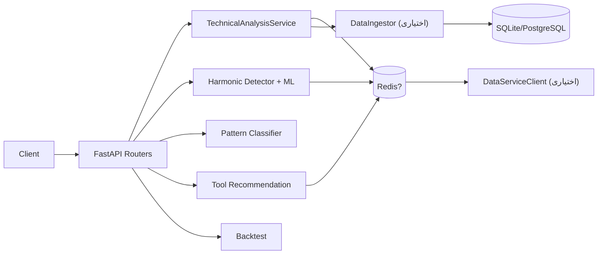

# Gravity Technical Analysis

سرویس FastAPI برای تحلیل تکنیکال، تشخیص الگو و توصیه ابزار. این نسخه با کد فعلی (1.0.0) همسو شده و بر پایه اندیکاتورهای کلاسیک، الگوهای هارمونیک و مدل‌های ML موجود عمل می‌کند.

## ویژگی‌ها
- ۶ دسته اندیکاتور (Trend/Momentum/Volatility/Cycle/Volume/Support-Resistance) + الگوهای شمعی و امواج الیوت.
- سیگنال نهایی و اطمینان کلی بر اساس وزن‌دهی داینامیک (signal_engine).
- تشخیص الگوهای هارمونیک (Gartley, Butterfly, Bat, Crab) با امتیازدهی ML اختیاری.
- توصیه ابزار و تحلیل سفارشی بر اساس کاتالوگ ۹۵+ ابزار و وزن‌های ML.
- بک‌تست سبک برای تشخیص الگو و ذخیره نتایج تحلیل (در صورت فعال‌سازی ingestion).
- کش Redis و سرویس داده خارجی اختیاری؛ سناریو سه‌گانه و DB Explorer به‌صورت اختیاری و با پرچم فعال می‌شوند.

## نیازمندی‌ها
- Python 3.12
- اختیاری: Redis، PostgreSQL/SQLite، فایل‌های مدل در `ml_models/`

## شروع سریع
```bash
pip install -r requirements.txt
copy .env.example .env
set PYTHONPATH=src
uvicorn gravity_tech.main:app --host 0.0.0.0 --port 8000 --reload
```
- مستندات تعاملی: `http://localhost:8000/api/docs`
- سلامت: `/health`, `/health/ready`
- نمونه درخواست: `POST /api/v1/analyze` با حداقل ۶۰ کندل
- راهنمای کامل: `docs/guides/QUICK_START.md`
- فایل مدل برای endpointهای ML/Pattern باید در `ml_models/pattern_classifier_*.pkl` باشد، در غیر این صورت پاسخ «model missing» می‌گیرید.

## اندپوینت‌های اصلی (خلاصه)
- `/api/v1/analyze` تحلیل کامل اندیکاتورها + الگوهای شمعی + الیوت + فاز بازار
- `/api/v1/patterns/detect` تشخیص الگوهای هارمونیک + امتیاز ML
- `/api/v1/ml/*` پیش‌بینی الگو و اطلاعات مدل ML
- `/api/v1/tools/*` توصیه ابزار و تحلیل سفارشی
- `/api/v1/backtest` بک‌تست تشخیص الگو
- `/api/v1/scenarios/*` تحلیل سناریو (در صورت `ENABLE_SCENARIOS=true`)
- `/db/*` اکسپلورر دیتابیس (در صورت `EXPOSE_DB_EXPLORER=true`)
- `/api/v1/patterns/detect` اکنون هدف/حدضرر داینامیک و `ml_status` بازمی‌گرداند.

جزئیات کامل در `docs/guides/API_REFERENCE.md`.

## معماری (کوتاه)


## تست
```bash
pytest
```
برای نادیده گرفتن وابستگی‌های خارجی، متغیرهای کش/پیام‌رسانی را در `.env` غیرفعال کنید.

## مستندات تکمیلی
- نمایه مستندات: `docs/INDEX.md`
- معماری: `docs/architecture/SYSTEM_ARCHITECTURE_DIAGRAMS.md`
- تصمیم‌گیر ۵بعدی: `docs/guides/FIVE_DIMENSIONAL_DECISION_GUIDE.md`
- ماتریس حجم: `docs/guides/VOLUME_MATRIX_GUIDE.md`
- استقرار: `docs/operations/DEPLOYMENT_GUIDE.md`
