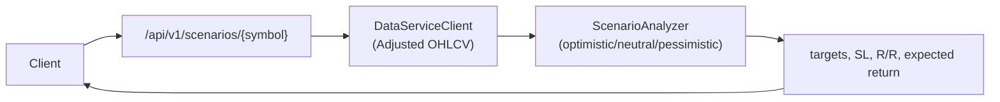
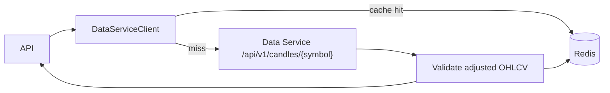
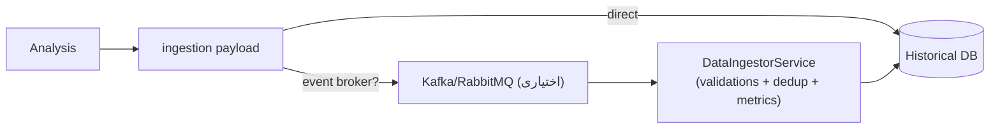

## 7) سناریو سه‌گانه (`/api/v1/scenarios/*` اختیاری)

- فقط با `ENABLE_SCENARIOS=true` فعال می‌شود. نیازمند داده Adjusted (سرویس داده یا DB محلی).
- ولیدیشن: نماد حداقل ۲ کاراکتر و حروف/عدد/-/./_؛ تایم‌فریم از لیست 1m..1w؛ lookback ≥30 روز؛ حداقل ۱۲۰ کندل معتبر (بدون NaN/Inf، high>=low، حجم>=۰) وگرنه 400.
- متریک‌ها: Counter/Histogram برای موفق/خطا/تاخیر اضافه شده است.
- خطاها: ورودی بد => 400؛ خطای سرویس داده/داخلی => 503.

## 8) یکپارچه‌سازی سرویس داده و کش

- ولیدیشن ورودی: نماد حداقل ۲ کاراکتر، فقط حروف/عدد/-/./_؛ تایم‌فریم 1m..1w؛ start<end و بازه ≤ ۱۰۹۵ روز.
- ولیدیشن خروجی: حداقل ۳۰ کندل، بدون NaN/Inf، high>=low و ترتیب زمانی صعودی؛ نقض => خطا.
- کش: کلید شامل base_url/symbol/timeframe/start/end است؛ miss ثبت می‌شود، TTL پیش‌فرض ۶ ساعت. در نبود Redis یا miss، داده از سرویس گرفته و پس از validate کش می‌شود.
## 9) اینجکشن و ذخیره‌سازی نتایج (اختیاری)

- ولیدیشن payload: نماد معتبر، تایم‌فریم 1m..1w، نبود NaN/Inf، حد سقف حجم داده (10MB)، کندل‌های مرتب و مثبت؛ در نقض، event رد می‌شود.
- Dedup ساده: کلید یکتا (symbol/timeframe/timestamp) در حافظهٔ کوتاه‌مدت نگه داشته می‌شود تا تکراری‌ها ذخیره نشوند.
- متریک‌ها: شمارنده/هیستوگرام موفق/خطا/تاخیر، شمارش retries و circuit-breaker.
- FallBack direct: اگر broker نباشد، ذخیره‌سازی مستقیم با ولیدیشن/احراز/تلاش مجدد انجام می‌شود؛ خطاها گزارش می‌شود.
## 10) سلامت و متریک
- `/health`, `/health/live`: وضعیت پایه سرویس.  
- `/health/ready`: چک Redis در صورت فعال بودن؛ در نبود Redis می‌توان `CACHE_ENABLED=false` کرد.  
- `/metrics`: Prometheus (اگر `METRICS_ENABLED=true`).

## 11) امنیت و دسترسی
- CORS در کد برای همه Origin باز است؛ در تولید باید در لایه لبه محدود شود.  
- DB Explorer (`/db/*`) فقط با `EXPOSE_DB_EXPLORER=true` فعال می‌شود و صرفاً برای توسعه توصیه می‌شود.  
- مدل‌های ML و داده Adjusted باید در مسیر/سرویس مناسب موجود باشند.
