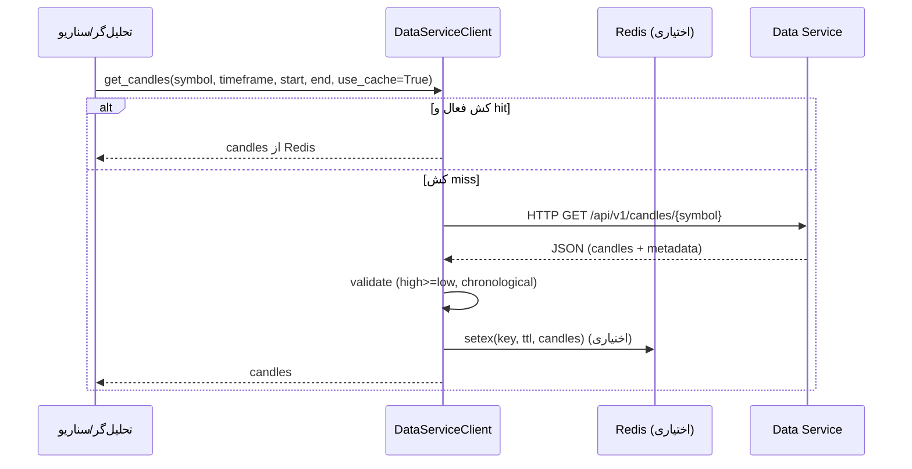

# یکپارچه‌سازی سرویس داده

این سند نحوه استفاده کد از `DataServiceClient` برای دریافت کندل‌های **adjusted** را توضیح می‌دهد.

## پیکربندی
تنظیمات در `config/settings.py`:
- `DATA_SERVICE_URL` (پیش‌فرض `http://localhost:8080`)
- `DATA_SERVICE_TIMEOUT` (ثانیه)
- `DATA_SERVICE_MAX_RETRIES`
- `REDIS_URL` و `CACHE_TTL` (۶ ساعت) برای کش پاسخ‌ها

فعال/غیرفعال کردن کش با `CACHE_ENABLED` و `redis_*` در `.env`.

## مسئولیت‌های DataServiceClient
- درخواست `GET /api/v1/candles/{symbol}` از سرویس داده با پارامترهای `timeframe`, `start_date`, `end_date`.
- اعتبارسنجی داده (ترتیب زمانی، high >= low، وجود فیلدهای adjusted).
- کش نتایج در Redis (کلید `candles:{symbol}:{timeframe}:{start}:{end}`).
- تبدیل پاسخ به مدل `CandleData`.

## جریان درخواست

## کاربرد در کد
- ماژول `api/v1/scenarios.py` از این کلاینت برای تحلیل سه‌سناریو‌ای استفاده می‌کند (Router پیش‌فرض mount نشده است؛ در صورت نیاز اضافه کنید).
- قابل استفاده برای هر مسیر داخلی دیگر که به داده Adjusted نیاز دارد؛ وابستگی به صورت `Depends(get_data_client)` تعریف شده است.
- اگر سرویس داده در دسترس نباشد، می‌توانید داده‌ی کندل را مستقیماً در بدنه `/api/v1/analyze` ارسال کنید یا دیتابیس محلی (TSE/SQLite/Postgres) را از پیش پر کنید.

## خطاها و رفتار
- در خطای HTTP، استثنا `httpx.HTTPStatusError` بالا داده می‌شود (FastAPI آن را به 503/500 تبدیل می‌کند).
- اگر Redis در دسترس نباشد، کلاینت با هشدار لاگ ادامه می‌دهد.
- اگر داده نامعتبر باشد (high < low یا عدم ترتیب زمان)، `ValueError` پرتاب می‌شود.

## توصیه‌های عملی
- برای محیط تولید، `DATA_SERVICE_URL` و `REDIS_URL` را از طریق Secret/Env تنظیم کنید.
- اگر داده محلی دارید، کش را فعال کنید تا فشار روی سرویس داده کم شود.
- بازه زمانی پیش‌فرض: ۱ سال گذشته؛ در فراخوانی‌ها `start_date`/`end_date` را مشخص کنید تا حجم پاسخ کنترل شود.
