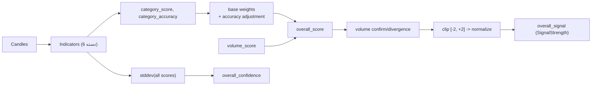

# محاسبه سیگنال نهایی

منطق تجمیع سیگنال در `services/signal_engine.py` پیاده‌سازی شده و بر روی `TechnicalAnalysisResult` اعمال می‌شود.

## مراحل
1. **امتیاز هر دسته**: برای هر اندیکاتور `signal_score = SignalStrength.get_score()` و وزن آن `confidence` است.  
   - `category_score = Σ(signal_score * confidence) / Σ(confidence)`  
   - `category_accuracy = میانگین confidence همان دسته`
2. **وزن پایه**: `trend=0.30`, `momentum=0.25`, `cycle=0.25`, `volume=0.20`.
3. **تنظیم وزن بر اساس دقت**: اگر داده کافی باشد، وزن‌ها متناسب با `category_accuracy` نرمالیزه می‌شوند.
4. **ترکیب پایه**:  
   ```
   overall_score = trend*trend_w + momentum*momentum_w + cycle*cycle_w
   ```
5. **تأیید/واگرایی حجم**:  
   ```
   volume_conf = |volume_score| * volume_w
   if sign(overall_score) == sign(volume_score):
       overall_score *= (1 + volume_conf)
   else:
       overall_score *= (1 - volume_conf)
   overall_score = clip(overall_score, -2.0, +2.0)
   normalized = overall_score / 2.0
   ```
6. **خروجی**:  
   - `overall_signal = SignalStrength.from_value(normalized)`  
   - `overall_confidence = 0.6 * agreement + 0.4 * avg_confidence`  
     - `agreement = 1 - stddev(all_signal_scores)/4` (در بازه 0..1)

## دیاگرام جریان


## خروجی‌های مرتبط در `TechnicalAnalysisResult`
- `overall_trend_signal`, `overall_momentum_signal`, `overall_cycle_signal`
- `overall_signal` (کلی)
- `overall_confidence` (0..1)

## نکات
- اگر هیچ اندیکاتوری موجود نباشد، سیگنال خنثی و `overall_confidence=0.5` برگردانده می‌شود.
- وزن حجم فقط به‌عنوان ضریب تأیید/واگرایی استفاده می‌شود و مستقیماً در مجموع پایه وارد نمی‌شود.
