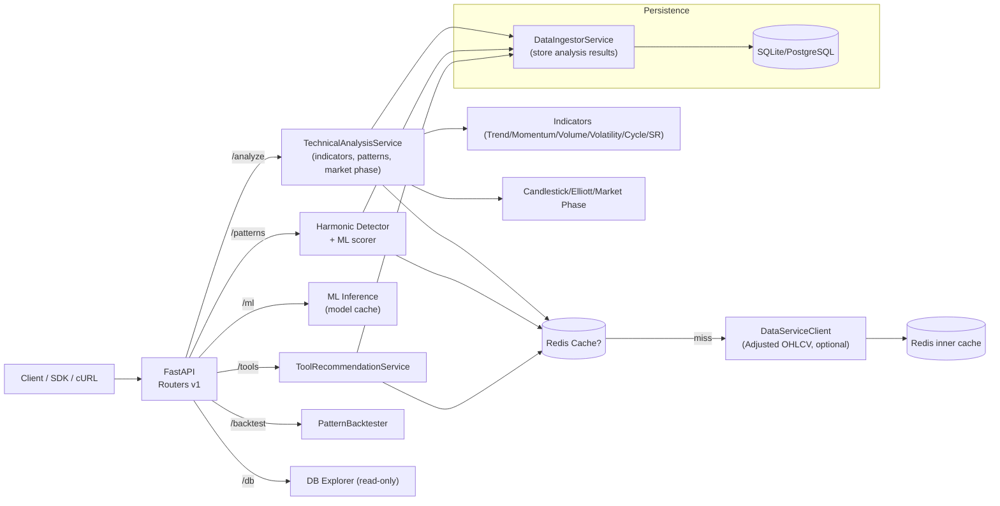
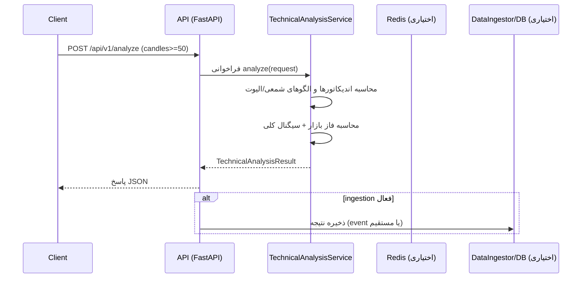

# معماری سامانه

این سند نمای کلی اجزا و نحوه عبور درخواست‌ها در نسخه 1.0.0 را توضیح می‌دهد.

## اجزا
- **FastAPI (`gravity_tech.main`)**: ثبت Routerهای `analysis`, `patterns`, `ml`, `tools`, `backtest`, `db`.
- **Core Services**: `TechnicalAnalysisService` برای اندیکاتورها و سیگنال نهایی؛ `ToolRecommendationService` برای توصیه ابزار؛ `PatternBacktester`.
- **کش اختیاری**: `cache_service` با Redis (TTL پیش‌فرض ۵ دقیقه).
- **دیتابیس**: SQLite/PostgreSQL از طریق `DatabaseManager` و `HistoricalScoreManager` (برای ذخیره نتایج در صورت فعال‌سازی ingestion).
- **سرویس داده اختیاری**: `DataServiceClient` جهت واکشی کندل Adjusted؛ Redis-cache داخلی دارد.
- **مدل‌های ML**: فایل‌های `ml_models/pattern_classifier_*.pkl` برای طبقه‌بندی الگو.
- **رویدادها (اختیاری)**: Kafka/RabbitMQ از طریق `middleware/events` و `data_ingestor_service`.

## نمودار اجزا

## جریان نمونه درخواست /api/v1/analyze

## نکات کلیدی
- CORS برای همه originها باز است؛ در محیط تولید محدود کنید.
- اگر Redis یا سرویس داده تنظیم نشود، مسیرها همچنان اجرا می‌شوند ولی کش/داده خارجی غیرفعال است.
- متریک‌های Prometheus با `settings.metrics_enabled` فعال می‌شوند و روی `/metrics` mount می‌شوند.
