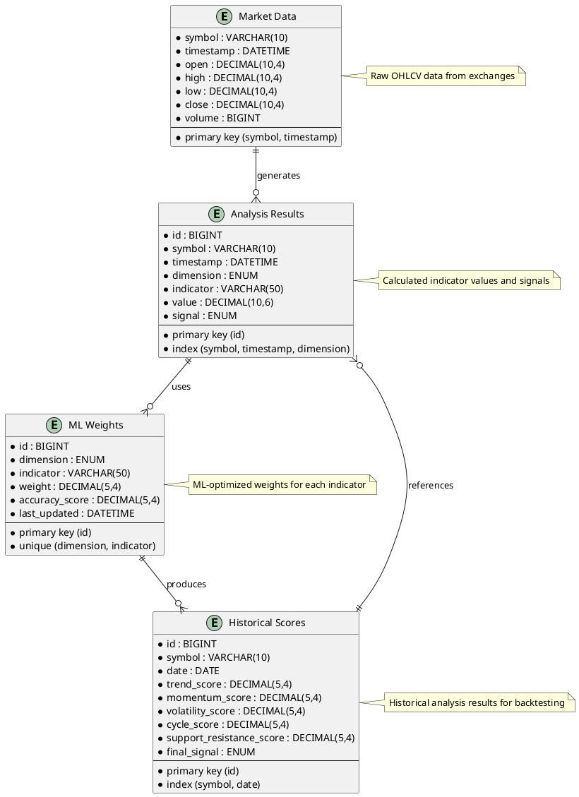
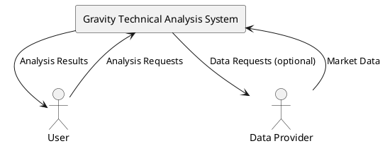
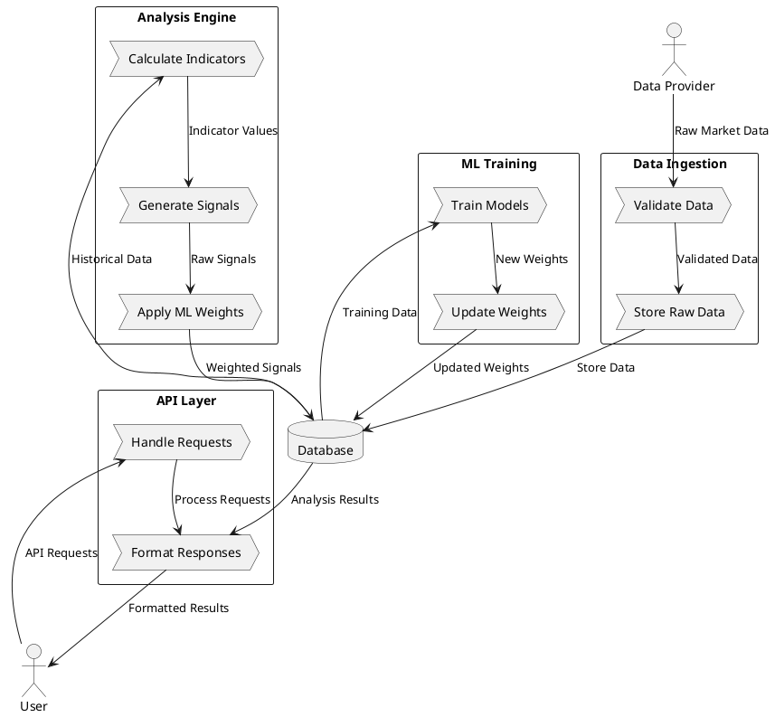
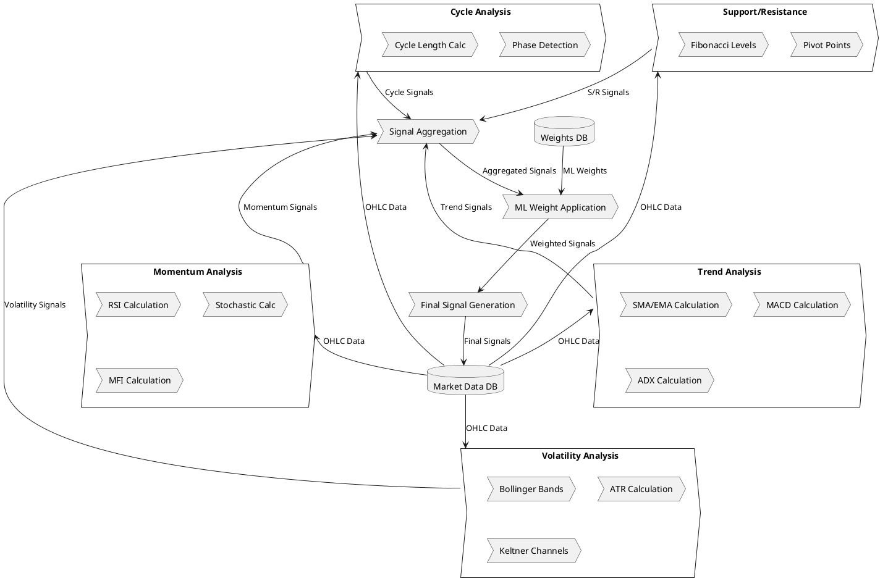
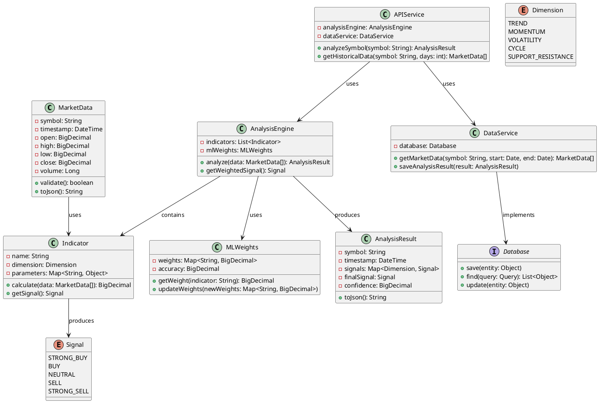
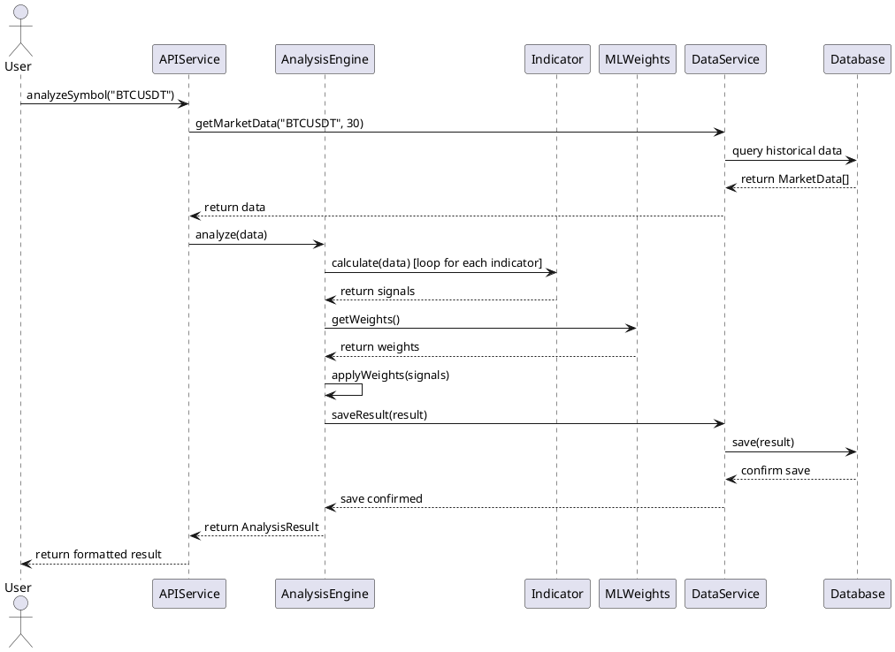
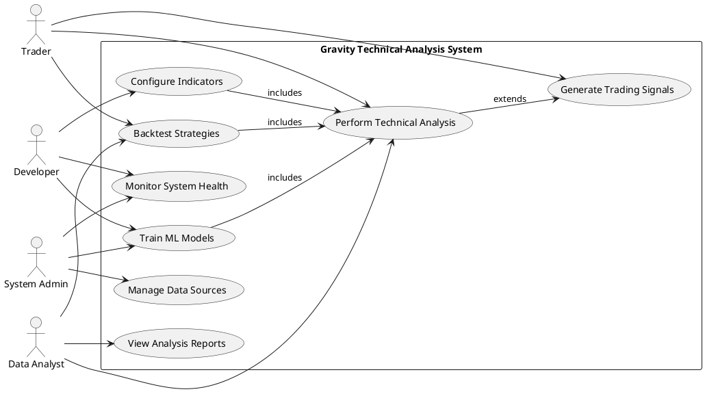
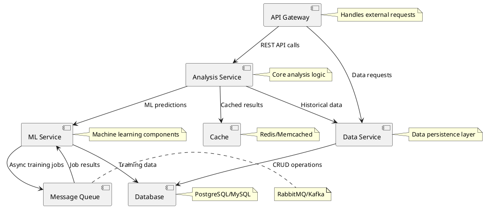
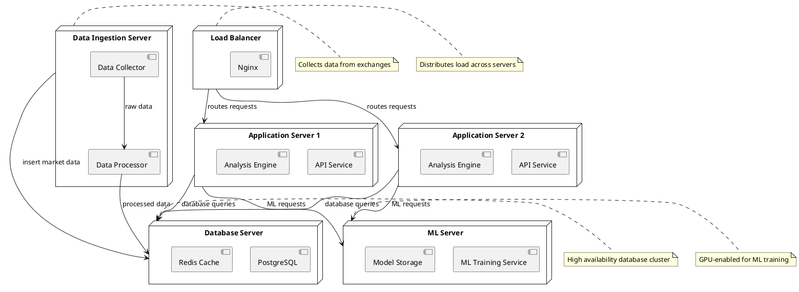

# System Diagrams

This document contains the complete and accurate UML, ER, and DFD diagrams for the Gravity Technical Analysis system.

## Table of Contents
1. [Entity-Relationship Diagram (ERD)](#entity-relationship-diagram-erd)
2. [Data Flow Diagram (DFD)](#data-flow-diagram-dfd)
3. [Unified Modeling Language (UML) Diagrams](#unified-modeling-language-uml-diagrams)

---

## Entity-Relationship Diagram (ERD)



---

## Data Flow Diagram (DFD)

### Level 0 - Context Diagram



### Level 1 - Main Processes



### Level 2 - Analysis Engine Detail



---

## Unified Modeling Language (UML) Diagrams

### Class Diagram



### Sequence Diagram - Analysis Request



### Use Case Diagram



### Component Diagram



### Deployment Diagram



---

## Diagram Rendering

To render these diagrams:
1. Install PlantUML plugin for your IDE/editor
2. Or use online PlantUML servers
3. Or use the PlantUML command-line tool

Example command:
```bash
plantuml SYSTEM_DIAGRAMS.md
```

This will generate PNG/SVG files for each diagram.

---

**Last Updated**: April 2024
**Version**: 1.0.0
