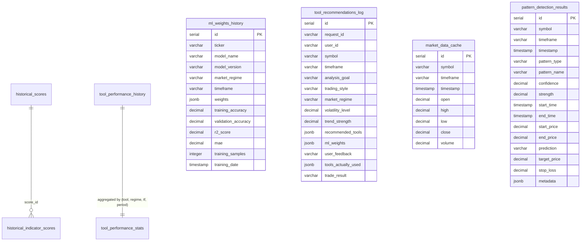

# مستند پایگاه‌داده و جریان داده

این سند تمام جداولی را که در این پروژه ساخته می‌شود (ورودی و خروجی)، فیلدها و توضیح کاربرد هر ستون را پوشش می‌دهد تا برنامه‌نویس بتواند در پروژه‌ای دیگر از این پایگاه داده استفاده کند.

## ۱) پایگاه ورودی (SQLite: `E:\Shakour\MyProjects\GravityTseHisPrice\data\tse_data.db`)
جداول عملیاتی TSE (تأمین داده خام):
- `sectors`  
  - `sector_id` (INTEGER, PK) شناسه صنعت  
  - `sector_name` (TEXT, UQ) نام صنعت  
  - `sector_name_en` (TEXT) نام انگلیسی  
  - `us_sector` (TEXT) نگاشت به طبقه‌بندی US
- `markets`  
  - `market_id` (INTEGER, PK) شناسه بازار  
  - `market_name` (TEXT, UQ)
- `panels`  
  - `panel_id` (INTEGER, PK)  
  - `panel_name` (TEXT, UQ)
- `companies`  
  - `company_id` (TEXT, PK) کد شرکت  
  - `ticker` (TEXT, UQ) نماد  
  - `name` (TEXT) نام شرکت  
  - `sector_id` (INTEGER, FK→sectors)  
  - `panel_id` (INTEGER, FK→panels)  
  - `market_id` (INTEGER, FK→markets)
- `price_data`  
  - `id` (INTEGER, PK AUTOINC)  
  - `date`/`j_date` (TEXT) تاریخ میلادی/جلالی  
  - `adj_open`/`adj_high`/`adj_low`/`adj_close`/`adj_final`/`adj_volume` (REAL) قیمت‌ها و حجم تعدیل‌شده  
  - `ticker` (TEXT) نماد  
  - `company_id` (TEXT, FK→companies)  
  - `UNIQUE(ticker, date)`
- شاخص‌ها:  
  - `indices_info(index_code PK, index_name_fa, index_name_en, index_type CHECK('market','sector'))`  
  - `market_indices(id PK AUTOINC, index_code FK→indices_info, j_date, date, open/high/low/close REAL, UNIQUE(index_code,date))`  
  - `sector_indices(id PK AUTOINC, sector_code FK→sectors(sector_id), j_date, date, open/high/low/close REAL, UNIQUE(sector_code,date))`
- نرخ ارز:  
  - `usd_prices(id PK AUTOINC, date UQ, j_date, open/high/low/close/final REAL)`
- کنترل به‌روزرسانی:  
  - `last_updates(symbol PK, last_date TEXT)`
- جداول نمونه فروشگاهی (غیرمرتبط با تحلیل بازار، برای تست):  
  - `customers(id PK, name NOT NULL, email UQ, phone, city, created_at)`  
  - `products(id PK, name UQ, description, price, stock, category, created_at, updated_at)`  
  - `sales(id PK, product_id FK→products, customer_id FK→customers, quantity, total_price, date)`

## ۲) پایگاه خروجی پروژه (Postgres پیش‌فرض، با Fallback SQLite/JSON)
این جداول توسط اسکریپت‌ها/مدیر پایگاه داده‌ی پروژه ساخته می‌شوند (`database/complete_schema.sql` و `database/tool_performance_history.sql`). در حالت SQLite، نوع‌ها ساده‌تر می‌شوند (JSONB→TEXT، TIMESTAMP→TEXT و …) اما نام و معنا یکسان است.

### هسته تحلیل
- `historical_scores` — خروجی تحلیل چندبعدی  
  - `id` (SERIAL, PK)  
  - `symbol` (VARCHAR(20)) نماد/جفت  
  - `timestamp` (TIMESTAMP) زمان تحلیل  
  - `timeframe` (VARCHAR(10)) بازه کندل  
  - امتیازها: `trend_score`, `momentum_score`, `combined_score` (DECIMAL(5,4))  
  - اطمینان‌ها: `trend_confidence`, `momentum_confidence`, `combined_confidence` (DECIMAL(5,4))  
  - وزن‌ها: `trend_weight`, `momentum_weight` (DECIMAL(5,4))  
  - سیگنال‌ها: `trend_signal`, `momentum_signal`, `combined_signal` (VARCHAR(20))  
  - متریک‌های تکمیلی: `volume_score`, `volatility_score`, `cycle_score`, `support_resistance_score` (DECIMAL(5,4))  
  - تصمیم: `recommendation` (VARCHAR(20)؛ BUY/SELL/HOLD)، `action` (VARCHAR(20)؛ ENTER/EXIT/WAIT)  
  - `price_at_analysis` (DECIMAL(15,8)) قیمت در زمان تحلیل  
  - `raw_data` (JSONB) داده خام تحلیل  
  - `created_at`, `updated_at` (TIMESTAMP)

- `historical_indicator_scores` — جزئیات اندیکاتور برای هر تحلیل  
  - `id` (SERIAL, PK)  
  - `score_id` (INTEGER, FK→historical_scores, ON DELETE CASCADE) مرجع تحلیل  
  - `symbol` (VARCHAR(20)) نماد  
  - `analysis_date` (TIMESTAMP) تاریخ تحلیل  
  - `timeframe` (VARCHAR(10)) بازه  
  - `indicator_name` (VARCHAR(50)), `indicator_category` (VARCHAR(50))  
  - `indicator_params` (JSONB) پارامترهای اندیکاتور  
  - `value` (DECIMAL(15,8)) مقدار محاسبه‌شده  
  - `signal` (VARCHAR(20)) سیگنال متنی  
  - `confidence` (DECIMAL(5,4)) اطمینان  
  - `created_at` (TIMESTAMP)

### عملکرد ابزارها و وزن‌های مدل
- `tool_performance_history` — ثبت پیش‌بینی ابزار/مدل و نتیجه  
  - `id` (SERIAL, PK)  
  - `tool_name` (VARCHAR(100)), `tool_category` (VARCHAR(50))  
  - `symbol` (VARCHAR(20)), `timeframe` (VARCHAR(10)), `market_regime` (VARCHAR(30)؛ trending_bullish/bearish/ranging/volatile)  
  - `volatility_level` (DECIMAL(5,2) 0-100), `trend_strength` (DECIMAL(5,2) 0-100), `volume_profile` (VARCHAR(20) high/medium/low)  
  - پیش‌بینی: `prediction_type` (VARCHAR(30)), `prediction_value` (DECIMAL(10,4)), `confidence_score` (DECIMAL(5,4))  
  - نتیجه واقعی: `actual_result` (VARCHAR(30)), `actual_price_change` (DECIMAL(10,4) درصد)، `success` (BOOLEAN), `accuracy` (DECIMAL(5,4))  
  - زمان‌بندی: `prediction_timestamp` (TIMESTAMP, default NOW), `result_timestamp` (TIMESTAMP), `evaluation_period_hours` (INTEGER)  
  - `metadata` (JSONB) جزئیات اضافی  
  - `created_at`, `updated_at` (TIMESTAMP)

- `tool_performance_stats` — آمار تجمیعی ابزار  
  - `id` (SERIAL, PK)  
  - `tool_name`, `tool_category` (VARCHAR)  
  - `market_regime` (VARCHAR(30)), `timeframe` (VARCHAR(10))  
  - `period_start`, `period_end` (DATE)  
  - شمارش/دقت: `total_predictions`, `correct_predictions` (INTEGER), `accuracy` (DECIMAL(5,4))  
  - `avg_confidence` (DECIMAL(5,4)), `avg_actual_change` (DECIMAL(10,4))  
  - شمارش و نرخ موفقیت: `bullish_predictions`, `bearish_predictions`, `neutral_predictions` و `bullish_success_rate`, `bearish_success_rate`, `neutral_success_rate`  
  - بهترین/بدترین: `best_accuracy`, `worst_accuracy`, `best_symbol`, `worst_symbol`  
  - `last_updated` (TIMESTAMP)  
  - `UNIQUE(tool_name, market_regime, timeframe, period_start, period_end)`

- `ml_weights_history` — وزن و متریک‌های مدل‌های ML  
  - `id` (SERIAL, PK)  
  - `model_name` (VARCHAR(100)), `model_version` (VARCHAR(20))  
  - `market_regime` (VARCHAR(30)), `timeframe` (VARCHAR(10))  
  - `weights` (JSONB) نگاشت اندیکاتور→وزن  
  - متریک‌ها: `training_accuracy`, `validation_accuracy`, `r2_score` (DECIMAL(5,4)), `mae` (DECIMAL(10,4))  
  - `training_samples` (INTEGER), `training_date` (TIMESTAMP)  
  - `metadata` (JSONB) تنظیمات/اهمیت ویژگی‌ها  
  - `created_at` (TIMESTAMP)

- `tool_recommendations_log` — لاگ توصیه‌ها و بازخورد  
  - `id` (SERIAL, PK)  
  - `request_id` (UUID), `user_id` (VARCHAR(100))  
  - `symbol` (VARCHAR(20)), `timeframe` (VARCHAR(10))  
  - هدف/سبک: `analysis_goal` (VARCHAR(50)), `trading_style` (VARCHAR(20))  
  - شرایط بازار: `market_regime` (VARCHAR(30)), `volatility_level` (DECIMAL(5,2)), `trend_strength` (DECIMAL(5,2))  
  - خروجی توصیه: `recommended_tools` (JSONB), `ml_weights` (JSONB)  
  - بازخورد: `user_feedback` (VARCHAR(20)), `tools_actually_used` (TEXT[]), `trade_result` (VARCHAR(20))  
  - `created_at`, `feedback_at` (TIMESTAMP)

### کش داده و تشخیص الگو
- `market_data_cache` — نگهداری OHLCV برای پردازش  
  - `id` (SERIAL, PK)  
  - `symbol` (VARCHAR(20)), `timeframe` (VARCHAR(10)), `timestamp` (TIMESTAMP)  
  - `open`, `high`, `low`, `close` (DECIMAL(15,8)), `volume` (DECIMAL(20,8))  
  - `created_at` (TIMESTAMP)  
  - `UNIQUE(symbol, timeframe, timestamp)`

- `pattern_detection_results` — خروجی تشخیص الگو  
  - `id` (SERIAL, PK)  
  - `symbol` (VARCHAR(20)), `timeframe` (VARCHAR(10)), `timestamp` (TIMESTAMP)  
  - `pattern_type` (VARCHAR(50)), `pattern_name` (VARCHAR(100))  
  - `confidence`, `strength` (DECIMAL(5,4))  
  - محدوده الگو: `start_time`, `end_time` (TIMESTAMP), `start_price`, `end_price` (DECIMAL(15,8))  
  - پیش‌بینی: `prediction` (VARCHAR(50)), `target_price`, `stop_loss` (DECIMAL(15,8))  
  - `metadata` (JSONB), `created_at` (TIMESTAMP)

### ویوها، توابع، تریگرها
- ویوهای موجود (Postgres):  
  - `v_recent_analysis` (آخرین ۲۴ ساعت از historical_scores)  
  - `v_top_tools` (۳۰ روز اخیر، ابزارهای برتر بر اساس accuracy)  
  - `v_market_regime_summary` (خلاصه هفتگی بر اساس رژیم بازار)  
  - از `tool_performance_history.sql`: `tool_performance_last_30_days`, `best_tools_by_regime`, `current_ml_weights`
- توابع (Postgres):  
  - `clean_old_data(days_to_keep INTEGER DEFAULT 90)` پاک‌سازی داده قدیمی از historical_scores، tool_performance_history، market_data_cache، pattern_detection_results  
  - `calculate_tool_accuracy(tool_name, market_regime, days)` محاسبه accuracy از tool_performance_history  
  - `record_tool_performance(...)` درج رکورد عملکرد ابزار  
  - `update_tool_result(id, actual_result, actual_change, success)` به‌روزرسانی نتیجه ابزار
- تریگرها (Postgres):  
  - `update_modified_column` روی historical_scores و tool_performance_history (به‌روزرسانی updated_at)  
  - `update_updated_at_column` در tool_performance_history.sql برای updated_at

### جداول تکمیلی تاریخچه (مرجع کد `src/gravity_tech/database/historical_manager.py`)
این جداول در کد استفاده می‌شوند ولی در فایل‌های SQL موجود باید تعریف شوند (در ریپو فعلی DDL صریح نداریم؛ ستون‌ها از کد استنتاج شده‌اند):
- `historical_horizon_scores` — امتیاز افق‌های ۳d/۷d/۳۰d  
  - `score_id` (FK→historical_scores), `horizon` (VARCHAR), `analysis_type` (VARCHAR), `score` (FLOAT/DECIMAL), `confidence` (FLOAT), `signal` (VARCHAR); `PRIMARY KEY(score_id, horizon, analysis_type)` توصیه می‌شود.
- `historical_patterns` — نتایج الگوهای نموداری  
  - `score_id` (FK), `pattern_type`, `pattern_name`, `score`, `confidence`, `signal`, `description`, `candle_indices` (JSON/ARRAY), `price_levels` (JSON), `projected_target` (NUMERIC).
- `historical_volume_analysis` — تحلیل حجم  
  - `score_id` (FK, PK)، `volume_score`, `volume_confidence`, `avg_volume`, `current_volume`, `volume_ratio`, `confirms_trend` (BOOLEAN).
- `historical_price_targets` — تارگت و استاپ  
  - `score_id` (FK), `target_type`, `target_price`, `stop_loss`, `expected_timeframe`, `confidence`.
- `analysis_metadata` — متادیتای آخرین تحلیل  
  - `symbol`, `timeframe`, `last_analysis_at`, `last_score_id`, `total_analyses`, `updated_at`; کلید یکتا روی `(symbol, timeframe)` توصیه می‌شود.
- ویو/توابع اضافی (طبق راهنما): `v_complete_scores`, `v_latest_scores`, `get_score_at_date`, `get_score_timeseries`, `cleanup_old_scores` (باید در فایل SQL تعریف شوند).

### جداول تجمعی نگهداشت (اختیاری، `scripts/maintenance/optimize_db.py`)
برای تسریع گزارش‌ها و کوئری‌های سبک:
- `historical_daily_summary`  
  - `symbol`, `timeframe`, `date`, `avg_score`, `min_score`, `max_score`, `avg_confidence`, `total_records`, `bullish_count`, `bearish_count`, `neutral_count`; `PRIMARY KEY (symbol, timeframe, date)`.
- `historical_weekly_summary`  
  - `symbol`, `timeframe`, `week_start`, `avg_score`, `trend_strength`, `consistency_score`, `total_records`; `PRIMARY KEY (symbol, timeframe, week_start)`.
- ایندکس‌ها: `idx_daily_summary_symbol_timeframe(symbol,timeframe,date DESC)`, `idx_weekly_summary_symbol_timeframe(symbol,timeframe,week_start DESC)`.

## ۳) جریان پردازش در پروژه (منبع → خروجی)
1) استخراج داده از `tse_data.db` → بارگذاری به `market_data_cache` (OHLCV، شاخص‌ها، دلار).  
2) محاسبه ویژگی‌ها و اسکورهای تحلیلی → `historical_scores` و جزئیات اندیکاتور در `historical_indicator_scores`.  
3) تشخیص الگو → `pattern_detection_results`.  
4) توصیه/سیگنال → `tool_recommendations_log` (همراه ابزارهای پیشنهادی و وزن‌های مدل).  
5) ارزیابی عملکرد ابزار/مدل با نتایج واقعی → `tool_performance_history` و تجمیع در `tool_performance_stats`; وزن‌های آموزش → `ml_weights_history`.  
6) نگهداشت → اجرای `clean_old_data` و تریگرهای زمان.

## ۴) دیاگرام‌ها
### ورودی SQLite
```mermaid
erDiagram
  sectors ||--o{ companies : "sector_id"
  markets ||--o{ companies : "market_id"
  panels  ||--o{ companies : "panel_id"
  companies ||--o{ price_data : "company_id"
  indices_info ||--o{ market_indices : "index_code"
  sectors ||--o{ sector_indices : "sector_code=sector_id"
  customers ||--o{ sales : "customer_id"
  products  ||--o{ sales : "product_id"
  usd_prices {
    integer id PK
    text date UQ
    text j_date
    real open
    real high
    real low
    real close
    real final
  }
  last_updates {
    text symbol PK
    text last_date
  }
```

### پایگاه خروجی پروژه


### جریان داده و پردازش

