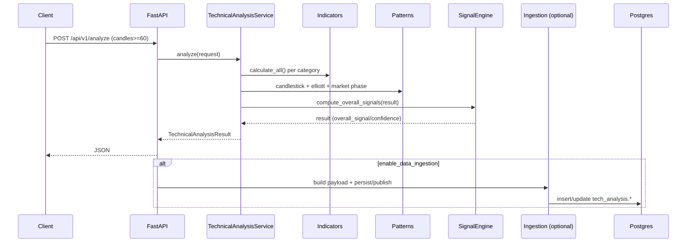

# معماری سیستم (System Architecture)

## 1) نمای کلان (Context)
این پروژه یک سرویس تحلیل تکنیکال است که می‌تواند در کنار سرویس‌های ingestion و/یا سرویس دیتای Adjusted کار کند.

```mermaid
flowchart LR
  User[کاربر/سیستم تصمیم‌یار] -->|HTTP| API[Gravity Analysis API]
  API -->|اختیاری| Redis[(Redis Cache)]
  API -->|اختیاری| DataSvc[Data Service (Adjusted OHLCV)]
  API -->|اختیاری| Broker[Kafka/RabbitMQ]
  API --> PG[(PostgreSQL: tech_analysis + tse_input)]
  Ingestion[Data Ingestion CLI] --> SQLite[(SQLite: tse_data.db)]
  SQLite -->|Migration| PG
```

## 2) اجزای اصلی و مسئولیت‌ها
### 2.1) سرویس API (FastAPI)
- مسیر: `apps/analysis_api/src/gravity_tech/main.py`
- روترها: `apps/analysis_api/src/gravity_tech/api/v1/*`
- ویژگی‌ها: OpenAPI/Swagger، Health، Metrics (Prometheus)، CORS، خطایابی سراسری

### 2.2) موتور تحلیل (Analysis Service)
- مسیر: `apps/analysis_api/src/gravity_tech/services/analysis_service.py`
- وظیفه: اجرای Pipeline محاسبات اندیکاتورها + الگوها + فاز بازار + تجمیع سیگنال

### 2.3) اندیکاتورها (Core Indicators)
- مسیر: `apps/analysis_api/src/gravity_tech/core/indicators/*.py`
- خروجی استاندارد: `IndicatorResult` (نام اندیکاتور، دسته، سیگنال، مقدار، confidence و…)

### 2.4) تشخیص الگو (Patterns)
- مسیرهای کلیدی:
  - `apps/analysis_api/src/gravity_tech/core/patterns/*` (کندلی/کلاسیک/دیورجنس/الیوت)
  - `apps/analysis_api/src/gravity_tech/patterns/harmonic.py` (هارمونیک)

### 2.5) ML (اختیاری)
- API: `apps/analysis_api/src/gravity_tech/api/v1/ml.py`
- مدل‌ها: `ml_models/pattern_classifier_*.pkl`
- وظیفه: امتیازدهی/طبقه‌بندی الگوها و پاسخ‌دهی batch

### 2.6) ذخیره‌سازی و تاریخچه (Postgres)
- اسکیمای مرجع: `scripts/schema/postgres_schema.sql`
- جداول کلیدی (نمونه):
  - `tse_input.price_data` (داده خام/Adjusted روزانه)
  - `tech_analysis.historical_scores` (امتیازهای روزانه/تاریخی)
  - `tech_analysis.pattern_detection_results` (نتایج تشخیص الگو)
  - `tech_analysis.ml_weights_history` (تاریخچه وزن‌ها/مدل‌ها)
  - `tech_analysis.backtest_runs` (نتایج بک‌تست)

## 3) جریان درخواست تحلیل کامل


## 4) استقرار (Docker Compose)
فایل: `docker-compose.stack.yml`

```mermaid
flowchart TB
  subgraph DockerHost[Docker Host]
    PG[(postgres:16)]
    API[analysis-api (FastAPI)]
    Runner[ingestion-runner (pipeline loop)]
  end
  Runner --> PG
  API --> PG
  User -->|:8000| API
```

## 5) تنظیمات و Feature Flags
تنظیمات از `gravity_tech.config.settings` خوانده می‌شود. چند گزینه مهم:
- `CACHE_ENABLED` و `REDIS_URL` برای فعال‌سازی Cache
- `METRICS_ENABLED` برای `/metrics`
- `ENABLE_SCENARIOS` برای `/api/v1/scenarios/*`
- `EXPOSE_DB_EXPLORER` برای مسیرهای DB Explorer (با کنترل دسترسی در هندلرها)
- `ENABLE_DATA_INGESTION` + تنظیمات Broker برای ingestion asynchronous

