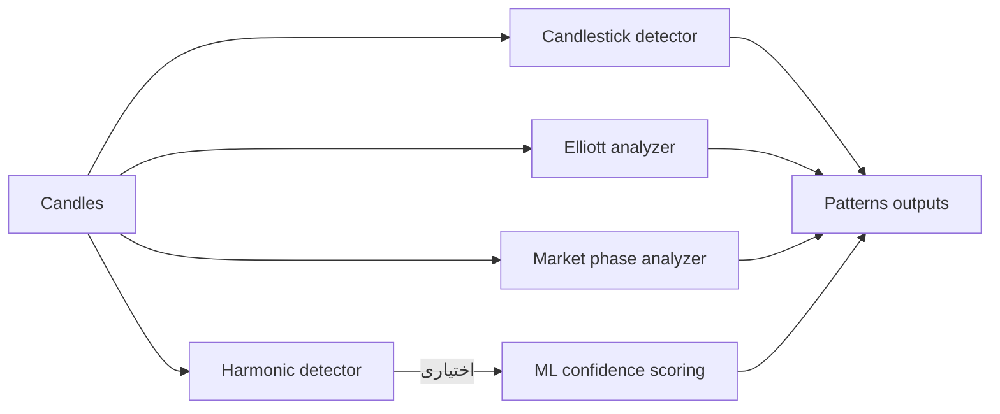

# تشخیص الگو (Pattern Detection)

## 1) دسته‌های الگو
پروژه چند خانواده الگو/تحلیل را پوشش می‌دهد:
- الگوهای کندلی (Candlestick)
- الگوهای هارمونیک (Harmonic: Gartley/Butterfly/Bat/Crab)
- تحلیل موج الیوت (Elliott Wave)
- تشخیص فاز بازار (Market Phase بر مبنای Dow Theory)

## 2) الگوهای کندلی (Candlestick)
مرجع: `apps/analysis_api/src/gravity_tech/core/patterns/candlestick.py`
- خروجی در `TechnicalAnalysisResult.candlestick_patterns` ذخیره می‌شود.
- هدف: تشخیص سریع ساختارهای بازگشتی/ادامه‌دهنده با قواعد کلاسیک.

## 3) الگوهای هارمونیک (Harmonic)
API: `apps/analysis_api/src/gravity_tech/api/v1/patterns.py`  
منطق تشخیص: `apps/analysis_api/src/gravity_tech/patterns/harmonic.py`

### 3.1) ورودی/خروجی
- ورودی: لیست کندل‌ها (حداقل ۶۰، سقف ۵۰۰۰) + `tolerance` + `min_confidence`
- خروجی: نقاط X/A/B/C/D، نسبت‌ها (Fibonacci ratios)، قیمت تکمیل، (اختیاری) confidence ML، اهداف و حد ضرر

### 3.2) نسبت‌های کلیدی هر الگو (طبق API)
- Gartley: XAB=0.618, ABC=0.382-0.886, BCD=1.272-1.618, XAD=0.786
- Butterfly: XAB=0.786, ABC=0.382-0.886, BCD=1.618-2.24, XAD=1.27-1.618
- Bat: XAB=0.382-0.50, ABC=0.382-0.886, BCD=1.618-2.618, XAD=0.886
- Crab: XAB=0.382-0.618, ABC=0.382-0.886, BCD=2.24-3.618, XAD=1.618

### 3.3) محاسبه هدف/حدضرر پویا
API از یک منطق ATR-like برای محاسبه target1/target2/stop_loss استفاده می‌کند (تابع `_dynamic_targets` در `api/v1/patterns.py`).

## 4) Elliott Wave
مرجع: `apps/analysis_api/src/gravity_tech/patterns/elliott_wave.py` و استفاده در `TechnicalAnalysisService`
- خروجی: ساختار موج (Impulsive/Corrective)، اعتبار قواعد، پروجکشن‌های فیبو، تخمین موج فعلی.

## 5) Market Phase (Dow Theory)
مرجع: `apps/analysis_api/src/gravity_tech/analysis/market_phase.py` و استفاده در `TechnicalAnalysisService`
- خروجی: فاز (Accumulation/Markup/Distribution/Markdown/Transition)، قدرت فاز، توصیه‌ها و امتیازهای جزئی.

