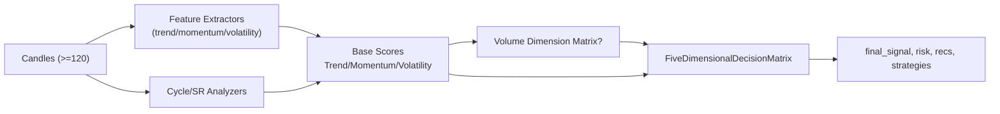

- پیش‌نیاز داده: حداقل ۱۲۰ کندل OHLCV سالم؛ ولیدیشن NaN/Inf، high>=low و حجم>=۰.
# راهنمای تصمیم‌گیر ۵بعدی

این سند خط لوله‌ی `CompleteAnalysisPipeline` و ماتریس تصمیم ۵بعدی را بر اساس کد فعلی توضیح می‌دهد.

## اجزای خط لوله
1. **ویژگی‌های پایه**:  
   - Trend/Momentum/Volatility: `MultiHorizonFeatureExtractor`، `MultiHorizonMomentumFeatureExtractor`، `MultiHorizonVolatilityFeatureExtractor` (پنجره‌های 100/120 کندلی).  
   - Cycle: `MultiHorizonCycleAnalyzer`.  
   - Support/Resistance: `MultiHorizonSupportResistanceAnalyzer`.  
2. **آنالیز ابعاد**:  
   - Trend/Momentum/Volatility به آنالایزر یا learner نیاز دارند (`MultiHorizonAnalyzer`, `MultiHorizonMomentumAnalyzer`, `MultiHorizonVolatilityAnalyzer`).  
   - Cycle/SR از آنالایزر داخلی استفاده می‌کنند.  
   - هر بعد خروجی `Score` با `signal`, `score`, `confidence` دارد.  
3. **ماتریس حجم (اختیاری)**: `VolumeDimensionMatrix.calculate_all_interactions()`؛ اگر `use_volume_matrix=False` باشد صرف‌نظر می‌شود.  
4. **ماتریس تصمیم ۵بعدی**: `FiveDimensionalDecisionMatrix.analyze()` امتیاز نهایی را از ترکیب پنج بعد (و تعاملات حجم) محاسبه می‌کند.

## دیاگرام خط لوله


## وزن‌دهی و ترکیب
- وزن پیش‌فرض ابعاد: `trend=0.30`, `momentum=0.25`, `volatility=0.15`, `cycle=0.15`, `support_resistance=0.05` (قابل override با `custom_weights`).
- اگر ماتریس حجم فعال باشد، امتیاز تعاملات به‌صورت ضریب اعتماد روی تصمیم اعمال می‌شود.
- توافق و ریسک با توجه به تعداد ابعادی که هم‌جهت هستند محاسبه می‌شود.

## خروجی‌های کلیدی (`FiveDimensionalDecision`)
- `final_signal`: یکی از `VERY_STRONG_BUY`, `STRONG_BUY`, `BUY`, `WEAK_BUY`, `NEUTRAL`, `WEAK_SELL`, `SELL`, `STRONG_SELL`, `VERY_STRONG_SELL`
- `final_score` در بازه `[-1, +1]`
- `final_confidence` و `signal_strength` (0..1)
- `risk_level`: `VERY_LOW`, `LOW`, `MODERATE`, `HIGH`, `VERY_HIGH`
- `agreement.overall_agreement` (0..1) و `risk_factors`
- توصیه عملی: `recommendation`, `entry_strategy`, `exit_strategy`
- مدیریت ریسک: `stop_loss_suggestion`, `take_profit_suggestion`
- زمینه بازار: `market_condition`, `key_insights`

## نکات اجرا
- حداقل داده پیشنهادی: 120 کندل برای اطمینان از استخراج ویژگی‌های کافی (Trend/Momentum/Volatility پنجره‌های 100/120 دارند).
- اگر learner یا analyzer برای Trend/Momentum/Volatility تزریق نشود، خط لوله خطا می‌دهد؛ در استفاده آزمایشی از نمونه‌های آموزش‌داده‌شده یا وزن‌های پیش‌فرض استفاده کنید.
- `use_volume_matrix=False` برای زمانی که داده حجم در دسترس نیست یا کیفیت پایین دارد.

## مثال کوتاه
```python
from gravity_tech.ml.complete_analysis_pipeline import CompleteAnalysisPipeline

pipeline = CompleteAnalysisPipeline(
    candles=candles,          # list[Candle]، ترجیحاً 120+
    use_volume_matrix=True,
    custom_weights={"trend": 0.35, "momentum": 0.25, "volatility": 0.15, "cycle": 0.15, "support_resistance": 0.10},
    verbose=False,
    trend_analyzer=trained_trend_analyzer,
    momentum_analyzer=trained_momentum_analyzer,
    volatility_analyzer=trained_volatility_analyzer,
)

result = pipeline.analyze()
print(result.decision.final_signal.value, result.decision.risk_level.value)
```
