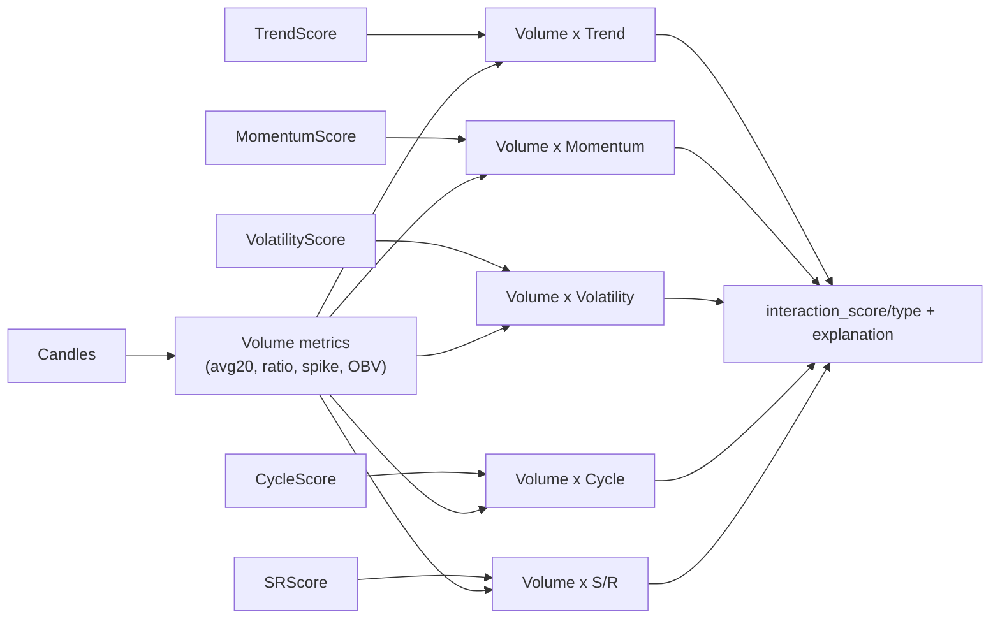

- حداقل داده: ۶۰ کندل با OHLCV سالم (بدون NaN/Inf، high>=low، حجم>=۰)؛ نقض => خطا.
- avg_volume با epsilon محافظت می‌شود تا division by zero رخ ندهد؛ RSI/MFI استاندارد و rejection با بدنه صفر نادیده گرفته می‌شود.
# ماتریس حجم (Volume-Dimension Matrix)

پیاده‌سازی در `ml/volume_dimension_matrix.py` قرار دارد و برای تأیید/واگرایی حجم نسبت به امتیاز هر بعد استفاده می‌شود. خروجی این ماژول به‌طور مستقیم در خط لوله ۵بعدی و همچنین در پاسخ `PipelineResult.volume_interactions` مصرف می‌شود.

## ورودی و پیش‌نیاز
- `candles`: حداقل ۵۰ رکورد (برای محاسبه میانگین ۲۰تایی و OBV).
- امتیاز هر بعد: `TrendScore`, `MomentumScore`, `VolatilityScore`, `CycleScore`, `SupportResistanceScore` (در بازه [-1, 1] با `signal` و `confidence`).

## سنجه‌های حجمی
خلاصه‌ای از `VolumeMetrics`:
- `volume_ratio`: نسبت حجم کندل آخر به میانگین ۲۰ کندل اخیر.
- `volume_trend`: شیب خط رگرسیون حجم ۲۰ کندل اخیر نسبت به میانگین.
- `volume_spike`: اگر `volume_ratio > 2.0` (اسپایک).
- `volume_in_bullish` / `volume_in_bearish`: سهم حجم در کندل‌های صعودی/نزولی ۲۰تایی.
- `obv_trend`: روند OBV ساده.

## انواع تعامل
`InteractionType`:  
- `STRONG_CONFIRM`, `CONFIRM`, `NEUTRAL`, `WARN`, `DIVERGENCE`, `FAKE`

هر تعامل (`VolumeDimensionInteraction`) شامل:
- `dimension_score`, `dimension_strength`, `dimension_state`
- `interaction_score` در بازه تقریبی `[-0.35, +0.35]`
- `interaction_type`, `confidence`, `explanation`, `signals[]`

## منطق کلی
- هم‌جهتی حجم با امتیاز بعد → `CONFIRM` یا `STRONG_CONFIRM` و ضریب مثبت.
- واگرایی یا ضعف حجم نسبت به امتیاز بعد → `WARN` یا `DIVERGENCE` و ضریب منفی.
- حجم غیرعادی مقابل جهت بعد → `FAKE`.

## دیاگرام


## نمونه خروجی
```json
{
  "trend": {
    "interaction_type": "STRONG_CONFIRM",
    "interaction_score": 0.28,
    "confidence": 0.82,
    "explanation": "حجم 2.1x و هم‌جهت با روند صعودی"
  },
  "momentum": {
    "interaction_type": "WARN",
    "interaction_score": -0.12,
    "confidence": 0.55,
    "explanation": "کاهش حجم در کندل‌های صعودی اخیر"
  }
}
```

## توصیه استفاده
- در خط لوله ۵بعدی، `interaction_score` به‌عنوان ضریب تقویتی/کاهنده برای `final_confidence` و توصیه نهایی استفاده می‌شود.
- اگر داده حجم ناقص است، می‌توانید `use_volume_matrix=False` در `CompleteAnalysisPipeline` قرار دهید تا تعاملات حجم در تصمیم نهایی لحاظ نشود.
