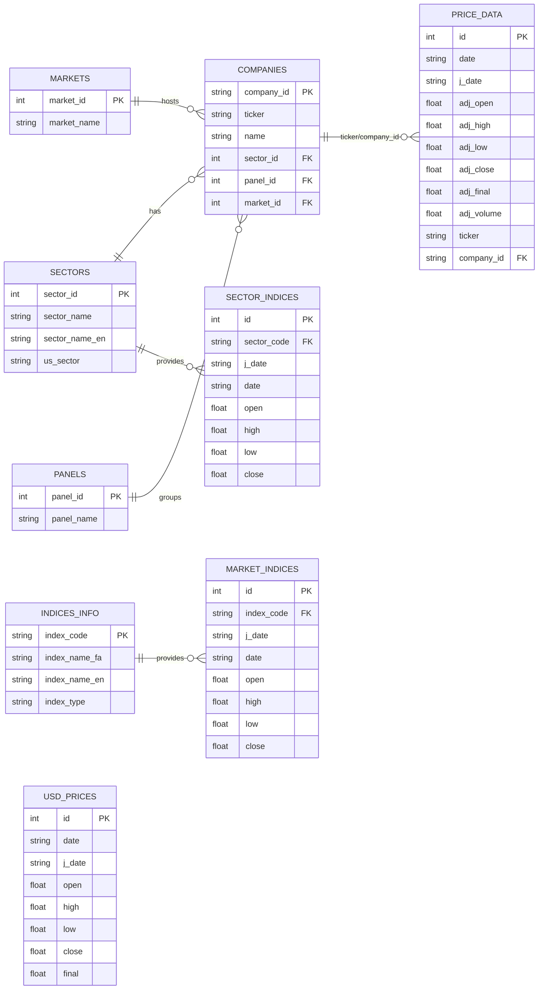
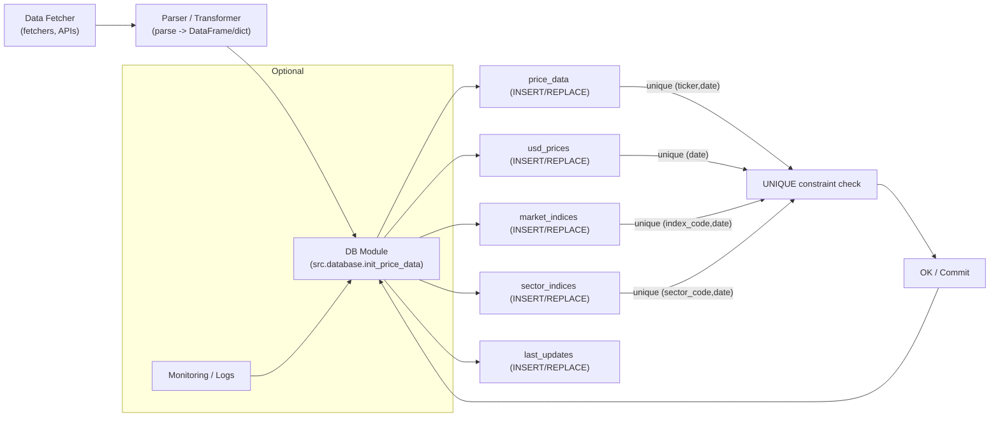
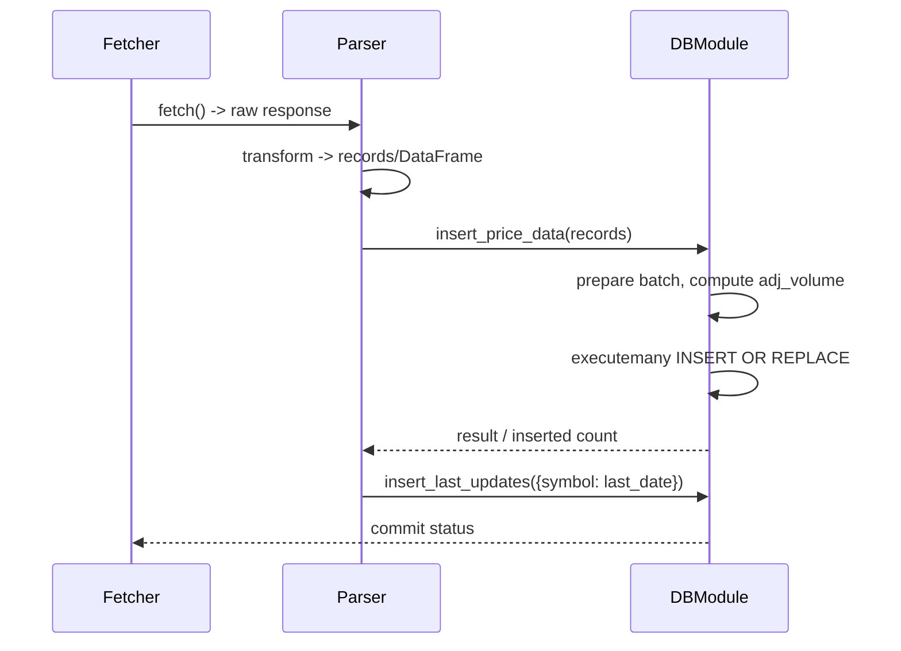

# مستندات پایگاه داده (برای برنامه‌نویسان)

این سند نسخهٔ مفصل و فنی از ساختار پایگاه دادهٔ پروژهٔ Historical TSE Price است. هدف این مستند ارائهٔ اطلاعات لازم برای توسعه‌دهندگان و افرادی است که می‌خواهند با دیتابیس کار کنند، اسکریپت‌های اولیه را اجرا کنند یا مایگریشن/بکاپ/بهینه‌سازی انجام دهند.

پایگاه داده یک فایل SQLite است به مسیر پیش‌فرض `data/tse_data.db` که مقدار آن در `src/config.py` به عنوان `DB_FILE` تعریف شده است.

نسخه‌های اصلی جداول و روابط به شرح زیر هستند. همچنین بخش‌های عملیاتی شامل نمونه کدهای Python برای اتصال، درج دسته‌ای (bulk insert)، و نکات عملکردی آورده شده‌اند.

---

## خلاصه جداول

- جداول مرجع (Reference): `sectors`, `markets`, `panels`, `companies`, `indices_info`
- جداول داده (Time-series / OHLC): `price_data`, `market_indices`, `sector_indices`, `usd_prices`
- جدول کمکی: `last_updates` (ردیابی آخرین تاریخ به‌روزرسانی برای نمادها)

---

## فایل پیکربندی و مسیر DB

- مسیر فایل دیتابیس در `src/config.py` با کلید `DB_FILE` قرار دارد:

```python
from src.config import DB_FILE
print(DB_FILE)  # data/tse_data.db (نسبت به BASE_DIR)
```

برای باز کردن اتصال از کد پروژه روش زیر استفاده می‌شود (در `src/database.py`):

```python
import sqlite3
from src.config import DB_FILE

conn = sqlite3.connect(DB_FILE)
conn.execute("PRAGMA foreign_keys = ON")
```

توجه: پروژه همیشه `PRAGMA foreign_keys = ON` را فعال می‌کند تا مراجع خارجی (FOREIGN KEY) کار کنند.

---

## تعریف جداول (SQL CREATE) — توضیح و نکات

در `src/database.py` توابعی برای ایجاد جداول وجود دارد. در ادامه شکل اصلی هر جدول به همراه توضیح فیلدها ذکر شده است.

1) `sectors` — جدول بخش‌ها

```sql
CREATE TABLE IF NOT EXISTS sectors (
    sector_id INTEGER PRIMARY KEY,
    sector_name TEXT UNIQUE,
    sector_name_en TEXT,
    us_sector TEXT
)
```

- `sector_id`: کد عددی بخش (مثلاً 1، 2، ...). این مقدار گاهی از داده‌های فایل‌های پایه گرفته می‌شود.
- `sector_name`: نام فارسی بخش (منحصربه‌فرد).

2) `markets` — انواع بازار

```sql
CREATE TABLE IF NOT EXISTS markets (
    market_id INTEGER PRIMARY KEY,
    market_name TEXT UNIQUE
)
```

3) `panels` — پنل‌های بازار

```sql
CREATE TABLE IF NOT EXISTS panels (
    panel_id INTEGER PRIMARY KEY,
    panel_name TEXT UNIQUE
)
```

4) `companies` — اطلاعات شرکت‌ها

```sql
CREATE TABLE IF NOT EXISTS companies (
    company_id TEXT PRIMARY KEY,
    ticker TEXT UNIQUE,
    name TEXT,
    sector_id INTEGER,
    panel_id INTEGER,
    market_id INTEGER,
    FOREIGN KEY(sector_id) REFERENCES sectors(sector_id),
    FOREIGN KEY(panel_id) REFERENCES panels(panel_id),
    FOREIGN KEY(market_id) REFERENCES markets(market_id)
)
```

- `company_id`: شناسهٔ یکتا برای شرکت‌ها (از منبع داده). اغلب رشته است.
- `ticker`: نماد معاملاتی که در قیمت‌ها استفاده می‌شود (مثلاً `FOLD1`).

5) `price_data` — داده‌های قیمتی شرکت‌ها (سطرهای زمانی)

```sql
CREATE TABLE IF NOT EXISTS price_data (
    id INTEGER PRIMARY KEY AUTOINCREMENT,
    date TEXT,         -- YYYY-MM-DD (Gregorian)
    j_date TEXT,       -- YYYY-MM-DD (Jalali)
    adj_open REAL,
    adj_high REAL,
    adj_low REAL,
    adj_close REAL,
    adj_final REAL,
    adj_volume REAL,
    ticker TEXT,
    company_id TEXT,
    FOREIGN KEY(company_id) REFERENCES companies(company_id),
    UNIQUE(ticker, date)
)
```

- مهم: `UNIQUE(ticker, date)` تضمین می‌کند که برای هر نماد و تاریخ تنها یک رکورد وجود داشته باشد.
- `j_date` قالب جلالی است و در بسیاری از گزارش‌ها و اندیس‌ها استفاده می‌شود؛ در حالی که `date` تاریخ میلادی (Gregorian) است.

6) `last_updates` — ردگیری تاریخ آخرین به‌روزرسانی

```sql
CREATE TABLE IF NOT EXISTS last_updates (
    symbol TEXT PRIMARY KEY,
    last_date TEXT
)
```

- این جدول برای واکشی افزایشی (incremental fetch) استفاده می‌شود؛ هر نماد یا شاخص با `symbol` ذخیره شده و مقدار `last_date` (معمولاً به فرمت جلالی) نگهداری می‌شود.

7) `indices_info` — متادیتای شاخص‌ها

```sql
CREATE TABLE IF NOT EXISTS indices_info (
    index_code TEXT PRIMARY KEY,
    index_name_fa TEXT NOT NULL,
    index_name_en TEXT,
    index_type TEXT NOT NULL CHECK(index_type IN ('market', 'sector'))
)
```

- این جدول با تابع `insert_indices_info()` در `src/database.py` مقداردهی اولیه می‌شود (شاخص‌های پیش‌فرض مانند `CWI`, `EWI`, ...).

8) `market_indices` — دادهٔ شاخص‌های بازار

```sql
CREATE TABLE IF NOT EXISTS market_indices (
    id INTEGER PRIMARY KEY AUTOINCREMENT,
    index_code TEXT NOT NULL,
    j_date TEXT NOT NULL,
    date TEXT NOT NULL,
    open REAL,
    high REAL,
    low REAL,
    close REAL,
    FOREIGN KEY(index_code) REFERENCES indices_info(index_code),
    UNIQUE(index_code, date)
)
```

9) `sector_indices` — دادهٔ شاخص‌های هر بخش

```sql
CREATE TABLE IF NOT EXISTS sector_indices (
    id INTEGER PRIMARY KEY AUTOINCREMENT,
    sector_code TEXT NOT NULL,
    j_date TEXT NOT NULL,
    date TEXT NOT NULL,
    open REAL,
    high REAL,
    low REAL,
    close REAL,
    FOREIGN KEY(sector_code) REFERENCES sectors(sector_id),
    UNIQUE(sector_code, date)
)
```

10) `usd_prices` — نرخ دلار (نمونه)

```sql
CREATE TABLE IF NOT EXISTS usd_prices (
    id INTEGER PRIMARY KEY AUTOINCREMENT,
    date TEXT,
    j_date TEXT,
    open REAL,
    high REAL,
    low REAL,
    close REAL,
    final REAL,
    UNIQUE(date)
)
```

---

## نکات عملیاتی و توصیه‌ها

- فعال کردن foreign keys: همیشه قبل از هر عملیاتی که به مراجع خارجی وابسته است `PRAGMA foreign_keys = ON` را اجرا کنید. کد پروژه به صورت مرکزی اینکار را هنگام گرفتن کانکشن انجام می‌دهد.
- تراکنش‌ها: برای عملیات دسته‌ای (bulk insert/updates) از `executemany()` و یک تراکنش استفاده کنید تا سرعت و سازگاری حفظ شود (پروژه همین الگو را دنبال می‌کند).
- ایندکس‌ها: با توجه به حجم داده‌ها، اضافه کردن ایندکس‌های مناسب می‌تواند سرعت جستجو را بهبود دهد. پیشنهادها:
  - `CREATE INDEX IF NOT EXISTS idx_price_ticker_date ON price_data(ticker, date);`
  - `CREATE INDEX IF NOT EXISTS idx_price_date ON price_data(date);`
  - `CREATE INDEX IF NOT EXISTS idx_market_index_code_date ON market_indices(index_code, date);`

- حالت WAL: برای افزایش همزمانی خواندن/نوشتن در SQLite می‌توانید `PRAGMA journal_mode = WAL` را در زمان راه‌اندازی فعال کنید، اما دقت کنید که پشتیبان‌گیری و سازگاری فایل باید رعایت شود.
- اندازه فایل و VACUUM: بعد از حذف‌های حجیم یا مایگریشن‌ها اجرای `VACUUM` به بازگرداندن فضای دیسک کمک می‌کند.

---

## نمونه‌های کد (Python)

- گرفتن کانکشن (استفادهٔ پروژه):

```python
from src.database import init_price_data

conn = init_price_data.get_connection()
cursor = conn.cursor()
cursor.execute('SELECT count(*) FROM companies')
print(cursor.fetchone())
conn.close()
```

- درج دسته‌ای دادهٔ قیمتی (نمونه ساده):

```python
records = [
    {
        'Date': '2023-01-01',
        'J-Date': '1401-10-11',
        'Adj Open': 1000.0,
        'Adj High': 1050.0,
        'Adj Low': 995.0,
        'Adj Close': 1020.0,
        'Adj Final': 1020.0,
        'Adj Volume': 10000,
        'Ticker': 'ABC1',
        'CompanyID': '12345'
    },
    # ...
]

init_price_data.insert_price_data(records)
```

- درج شاخص‌ها از یک DataFrame (پاندا):

```python
df = ...  # pandas DataFrame indexed by Jalali date or with a Date column
init_price_data.insert_market_indices('CWI', 'شاخص کل', df)
```

توجه: توابع `insert_*` در `src/database.py` از `INSERT OR REPLACE`/`INSERT OR IGNORE` استفاده می‌کنند تا از رکوردهای تکراری جلوگیری شود یا مقادیر جایگزین شوند.

---

## قواعد داده‌ای و نکات همگانی

- فرمت تاریخ‌‌ها:
  - `date`: فرمت میلادی `YYYY-MM-DD` (به عنوان رشته ذخیره می‌شود).
  - `j_date`: فرمت جلالی `YYYY-MM-DD` (برای تطابق با داده‌های داخلی TSE).
- حجم‌ها و قیمت‌ها به صورت `REAL` ذخیره می‌شوند؛ اگر نیاز به دقت عددی مالی بیشتر دارید، باید از نوع‌های ثابت یا تبدیل قبل از ذخیره‌سازی استفاده شود.
- در تابع `insert_price_data` یک شرط وجود دارد که رکوردهایی با `Ticker == 'USD'` نادیده گرفته می‌شوند؛ نرخ دلار در جدول `usd_prices` نگهداری می‌شود.

---

## مهاجرت‌ها / افزودن ستون جدید

- برای اضافه کردن ستون جدید در SQLite از `ALTER TABLE` استفاده کنید:

```sql
ALTER TABLE price_data ADD COLUMN adjusted_factor REAL;
```

- اگر نیاز به تغییر نوع ستون یا حذف ستون باشد، شیوهٔ توصیه‌شدهٔ SQLite ایجاد جدول جدید با ساختار جدید، انتقال داده‌ها و سپس حذف جدول قدیمی و تغییر نام جدول جدید است.

---

## نکات تست و CI

- در تست‌های پروژه برخی اسکریپت‌ها به اینترنت متکی‌اند (مثلاً فراخوانی سرویس‌های tsetmc). هنگام اجرای تست‌ها در محیط بدون دسترسی به اینترنت یا CI، تست‌های وابسته به شبکه باید mock شوند یا با marker جداگانه اجرا شوند. (مثلاً `pytest -k "not network"` یا استفاده از `requests-mock`).
- برای اطمینان از سازگاری، تست‌های مربوط به دیتابیس می‌توانند از یک فایل DB موقتی (`:memory:` یا temp file) استفاده کنند و پس از هر تست پاک‌سازی انجام دهند.

---

## رویه‌های پشتیبان‌گیری و نگهداری

- پشتیبان‌گیری: برای بکاپ‌گیری منظم از فایل `data/tse_data.db` یک cron job یا اسکریپت ویندوزی بسازید که فایل را کپی کرده و تاریخ را به نام فایل اضافه کند.
- بررسی سلامت: قبل از کپی گرفتن می‌توانید `PRAGMA integrity_check` را اجرا کنید.

```sql
PRAGMA integrity_check;
```

---

## نقاط تماس در پروژه (کجاها در کد با دیتابیس کار می‌شود)

- `src/database.py` — ایجاد جدول‌ها، درج داده‌ها و helperهای اصلی.
- `scripts/init_db.py` — اسکریپت‌های راه‌اندازی/بارگذاری اولیه (seed).
- `scripts/load_data.py`, `scripts/reload_all_indices.py` و دیگر اسکریپت‌های در `scripts/` که داده‌ها را fetch و در دیتابیس درج می‌کنند.

برای دیدن تمام نقاطی که به دیتابیس اشاره می‌کنند، می‌توانید grep کنید:

```pwsh
Select-String -Path . -Pattern "connect\(|DB_FILE|tse_data.db" -SimpleMatch -List
```

---

## جمع‌بندی و اقدامات پیشنهادی

- این فایل مرجع باید همواره هنگام اضافه کردن ستون‌های جدید یا تغییر رفتار توابع درج (`insert_*`) به‌روز شود.
- پیشنهاد می‌کنم برای عملیات بزرگ داده‌ای (مثلاً بارگذاری تاریخچه کامل یا تغییرات schema) از فایل پشتیبان قبل از اعمال تغییرات استفاده کنید و در CI تست‌های دیتابیس را با داده‌های کنترل‌شده اجرا کنید.

اگر می‌خواهید، می‌توانم:
- نمونهٔ کامل‌تر mardown با SQL DDL استخراج‌شده بنویسم، یا
- اسکریپت کوچک برای ایجاد ایندکس‌های پیشنهادی اضافه کنم، یا
- تست‌های دیتابیس را به CI-friendly تبدیل کنم (استفاده از `:memory:` DB و mocks).

---

**دیاگرام‌ها**

در ادامه دیاگرام‌های اصلی که برای درک ساختار دیتابیس و جریان داده‌ها مفید هستند درج شده‌اند. این دیاگرام‌ها به صورت Mermaid نوشته شده‌اند و در اکثر renderers (Docsify / GitHub با پلاگین / mermaid live) قابل نمایش‌اند.

1) دیاگرام ER (نشان‌دهندهٔ جداول و روابط اصلی)



2) دیاگرام جریان داده (ETL) — نشان‌دهندهٔ مسیر داده‌ها از fetch تا insert



3) دیاگرام sequence (جریان تعامل بین fetcher/parser و DB هنگام درج دسته‌ای)



---

نکات:
- این دیاگرام‌ها برای درک سریع ساختار و جریان داده خدمت می‌کنند؛ برای مستندسازی رسمی‌تر می‌توانید فایل‌های جداگانهٔ Mermaid در پوشه‌ای مانند `docs/diagrams/` ایجاد کنید تا قابل رندر/ریویو در CI باشند.
- اگر مایل باشید، من می‌توانم این دیاگرام‌ها را جداگانه در `docs/diagrams/*.mmd` ذخیره و یک اسکریپت تولید تصاویر از آنها (با mermaid-cli) اضافه کنم.

موفق باشید.

