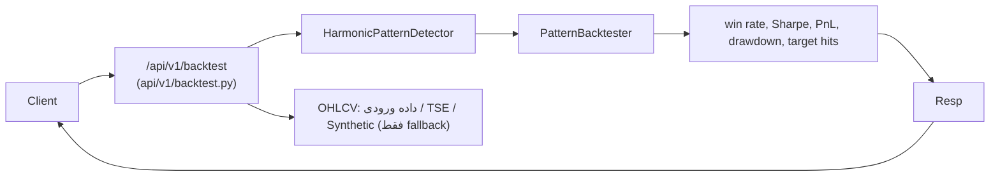

# فرایند بک‌تست تشخیص الگو (`POST /api/v1/backtest`)

## جریان کلی

## ورودی/خروجی
- ورودی: `BacktestRequest` با یکی از دو حالت زیر:
  - OHLCV کاربر: `highs/lows/closes/volumes` (الزامی هم‌طول، حداقل max(window+step، 300) کندل) + `dates` اختیاری (epoch ms صعودی).
  - یا `symbol` برای بارگذاری داده واقعی TSE (حداقل max(window+step، 400) کندل).
- پارامترها: `min_confidence`، `window_size` (پیش‌فرض 200)، `step_size` (پیش‌فرض 50)، `persist`.
- خروجی: `BacktestResponse` شامل `metrics`, `trade_count`, `backtest_period`, `analysis_time_ms`, `data_source` (provided/tse_db/synthetic)، `warnings`.

## کنترل‌های اعتبارسنجی
- طول همه آرایه‌های OHLCV باید برابر و >= max(window+step, 300) باشد؛ در غیر این صورت 400.
- مقادیر باید finite و `high >= low` و `low <= close <= high` باشند؛ NaN/Inf => 400.
- `dates` (در صورت وجود) باید هم‌طول و غیرکاهشی باشد؛ خطا => 400.
- اگر دادهٔ واقعی برای `symbol` یافت نشود، پاسخ 200 با `data_source=synthetic` و هشدار برمی‌گردد؛ در این حالت `persist` انجام نمی‌شود.

## نکات اجرا
- `window_size` و `step_size` مستقیماً به PatternBacktester اعمال می‌شود (اسلایدینگ‌ویندو داینامیک).
- در خطای محاسبهٔ بک‌تست، 500 برگردانده می‌شود (دیگر 200 با متریک صفر نیست).
- `persist=true` فقط وقتی داده واقعی یا ورودی کاربر استفاده شده ذخیره می‌کند؛ آرایه‌های بزرگ در DB ذخیره نمی‌شوند.
