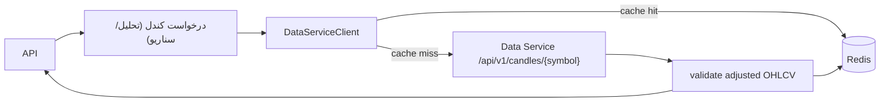

# فرایند کش و سرویس داده

## جریان داده

## رفتار
- اگر `CACHE_ENABLED=true` و `REDIS_URL` تنظیم شود، پاسخ کندل‌ها با TTL پیش‌فرض ۶ ساعت ذخیره می‌شود.  
- اگر Redis یا Data Service در دسترس نباشد، مسیرهای تحلیل می‌توانند با داده ورودی مستقیم یا DB محلی اجرا شوند (اما سناریوها بدون داده سرویس شکست می‌خورند).

## تنظیمات
- `DATA_SERVICE_URL`, `DATA_SERVICE_TIMEOUT`, `DATA_SERVICE_MAX_RETRIES`, `REDIS_URL`, `cache_ttl`.  
- `cache_enabled` در settings برای readiness و استفاده از Redis.

## ریسک‌ها
- در نبود Redis readiness ممکن است 503 برگرداند؛ می‌توان `CACHE_ENABLED=false` کرد.  
- حجم پاسخ بزرگ می‌تواند Redis را تحت فشار بگذارد؛ TTL و کلیدها مدیریت شود.
