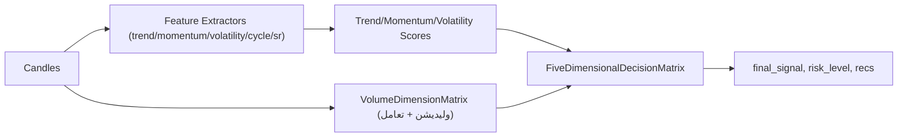

# فرایند تصمیم‌گیر ۵بعدی (داخلی)

## جریان کلی

## ورودی/خروجی
- ورودی: حداقل ۱۲۰ کندل OHLCV سالم (بدون NaN/Inf، high>=low، حجم غیرمنفی).
- خروجی: `FiveDimensionalDecision` شامل `final_score|confidence|signal`، وزن‌های داینامیک، توصیه ورود/خروج، R/R، risk_level، key_insights.

## گام‌ها
1. استخراج ویژگی‌های چندبازه‌ای (trend/momentum/volatility) + cycle/SR (پنجره‌های ۱۰۰/۱۲۰).
2. (اختیاری) ماتریس حجم: محاسبه VolumeMetrics (نسبت حجم، OBV، spike، جهت حجم) با کف صفر و اعتبارسنجی.
3. تعامل حجم×۵بعد: score و confidence هر بعد با کفی ۰.۱ و clip در [-1,+1] تنظیم می‌شود؛ در صورت خطا/نبود ماتریس حجم، توضیح «حجم غیرفعال» افزوده می‌شود.
4. تصمیم ۵بعدی: وزن‌ها نرمال می‌شوند (fallback اگر جمع صفر)؛ final_confidence با فرمول neutral-safe (std/(|mean|+0.5)) محاسبه می‌شود تا حالت خنثی تنبیه نشود.

## اعتبارسنجی/حفاظت
- حداقل کندل: ۱۲۰ (پوشش پنجره‌های ۱۰۰/۱۲۰ و ۲۰تایی حجم). کمتر => خطا.
- OHLCV باید finite باشد، high>=low، حجم>=۰؛ نقض => خطا.
- ماتریس حجم: avg_volume از epsilon استفاده می‌کند و division by zero مهار می‌شود؛ MFI/RSI استاندارد روی قیمت بسته/typical محاسبه می‌شوند.
- confidence هر بعد کف ۰.۱ دارد تا حذف کامل بعد در ضرب حجم رخ ندهد.

## ریسک‌ها/خروجی‌های هشدار
- در صورت شکست Volume Matrix یا داده ناکافی، توضیح «حجم غیرفعال: …» به description اضافه می‌شود.
- Breakout/Rejection با بدنه صفر شناسایی نمی‌شود (برای جلوگیری از false positive).
