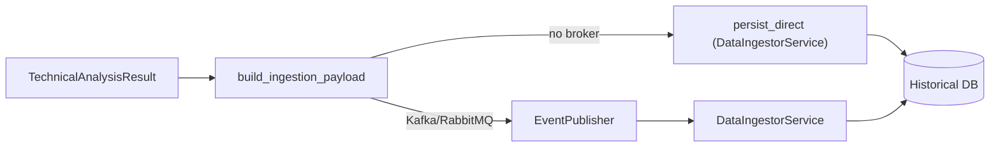

# فرایند ingestion و متریک‌ها

## ingestion نتایج تحلیل (اختیاری)

### رفتار
- اگر `enable_data_ingestion=true` و بروکر فعال نباشد، ذخیره‌سازی مستقیم انجام می‌شود (best-effort؛ در صورت خطا فقط log هشدار).  
- اگر Kafka/RabbitMQ فعال باشد، رویداد `ANALYSIS_COMPLETED` منتشر و سپس در Ingestor ذخیره می‌شود.

### ریسک‌ها
- هیچ تضمین تحویلی وجود ندارد؛ خطاها بی‌سر و صدا log می‌شوند.  
- ساختار DB باید مطابق `HistoricalScoreManager` باشد.

## متریک‌ها
- `/metrics` (Prometheus) اگر `METRICS_ENABLED=true` در settings باشد.  
- شمارنده‌ها/هیستوگرام‌ها برای ML prediction, backtest, cache hits در بخش‌های مربوطه تعریف شده‌اند.  
- برای تولید، دسترسی به `/metrics` باید در لایه لبه محدود شود.
