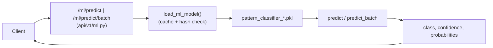

# فرایند پیش‌بینی ML (`/api/v1/ml/predict`, `/predict/batch`, `/model/info`, `/health`)

## جریان کلی

## ورودی/خروجی
- ورودی: ۲۱ ویژگی الگو (هندسه، حجم، اندیکاتورهای کمکی).  
- خروجی: `predicted_pattern`, `confidence`, `probabilities`, `model_version`, `inference_time_ms`, `model_hash`.
- `/predict/batch`: حداکثر 256 رکورد در هر درخواست؛ خطا در هر رکورد به‌صورت جداگانه log می‌شود و بقیه ادامه می‌یابد.
- در صورت نبود مدل، از مدل fallback استفاده می‌شود (`model_version=fallback`, احتمال برابر، confidence=0).
- Timeout: `predict` پیش‌فرض 2s (قابل override)، `predict_batch` پیش‌فرض 5s.

## خطاها
- نبود مدل: 503 با پیام «No ML model found…».  
- خطای داخلی: 500 با پیام «Prediction failed: …».  
- `/health`: در نبود مدل وضعیت `degraded` برمی‌گرداند.
- ورودی نامعتبر (NaN/Inf/بیش از 1e6): 400 از Pydantic به دلیل اعتبارسنجی ویژگی‌ها.
- Timeout: در صورت گذشت از زمان تعیین‌شده، 504 برگردانده می‌شود.

## تنظیمات و رفتار
- مدل‌ها در `ml_models/pattern_classifier_advanced_v2.pkl` یا `pattern_classifier_v1.pkl`.  
- Hash فایل برای کش استفاده می‌شود؛ تغییر فایل → بارگذاری مجدد.  
- متریک‌های Prometheus برای تعداد درخواست و زمان پاسخ ثبت می‌شوند (در صورت نصب prometheus_client).

## ریسک‌های کد
- وابستگی به فایل مدل روی دیسک؛ اگر حذف شود endpoint کار نمی‌کند.  
- هیچ محدودیتی روی مقدار ورودی batch تعریف نشده؛ ممکن است از نظر حافظه/زمان زیاد شود.  
- دقت/اطلاعات مدل در `model/info` ثابت (هاردکد) است؛ نیاز به به‌روزرسانی در صورت تغییر مدل.
