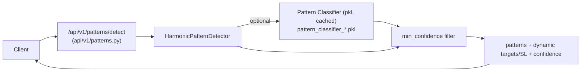
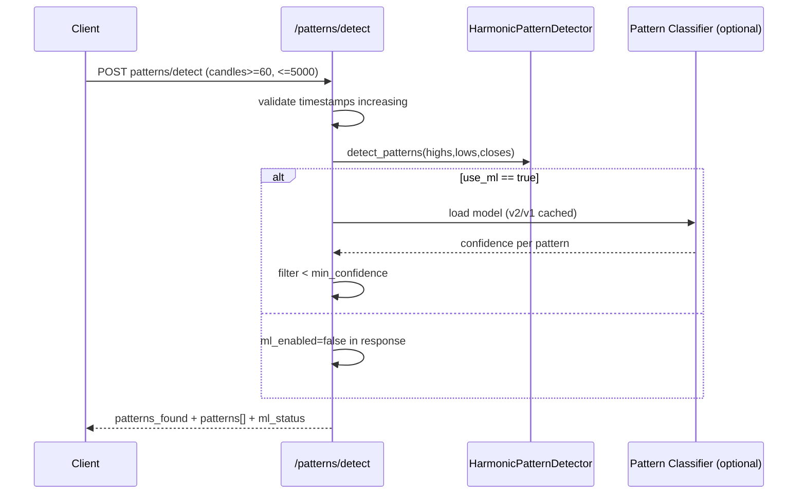

# فرایند تشخیص الگوهای هارمونیک (`POST /api/v1/patterns/detect`)

## جریان کلی

## ورودی/خروجی
- ورودی: `PatternDetectionRequest` با حداقل ۶۰ و حداکثر 5000 کندل، `pattern_types` اختیاری، `use_ml`, `min_confidence`, `tolerance`.
- `timeframe` با regex محدود است؛ `candles` باید از نظر زمانی strictly increasing باشند.
- خروجی: الگوها با نقاط X/A/B/C/D، اهداف/حدضرر داینامیک (ATR-like)، مدت تحلیل (ms)، `ml_enabled` و `ml_status` (enabled/disabled/not_available/failed).

## سکانس

## تنظیمات/وابستگی‌ها
- مدل در `ml_models/pattern_classifier_*.pkl` برای امتیاز ML؛ در نبود مدل `ml_enabled=false` و `ml_status` منعکس می‌شود.
- `tolerance` پیش‌فرض 0.05 (۵٪).
- حداقل کندل ۶۰؛ حداکثر 5000.

## خطاها
- ترتیب زمانی نادرست: 400 با پیام "Candles must be strictly increasing in time".
- تعداد کندل بیش از حد: 400 با پیام "Too many candles".
- نبود/خطای مدل: هشدار log و `ml_enabled=false`/`ml_status` متناسب.
- خطای داخلی: 500 با پیام «Pattern detection failed: ...».

## مشکلات/ریسک‌های باقی‌مانده
- وابستگی به فایل مدل روی دیسک (عدم حضور → فقط تشخیص هندسی).
- سقف 5000 کندل ممکن است برای ورودی بسیار بزرگ همچنان زمان‌بر باشد.
- اهداف/حدضرر ATR-like ساده هستند؛ در صورت نیاز باید منطق دقیق‌تری اعمال شود.
