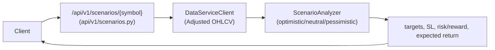

# فرایند سناریوی سه‌گانه (`/api/v1/scenarios/*` – اختیاری)

## جریان کلی

## شرایط فعال‌سازی
- فقط اگر `ENABLE_SCENARIOS=true` در settings باشد Router mount می‌شود.  
- نیازمند داده Adjusted (سرویس داده یا DB محلی). `lookback_days` حداقل ۳۰.

## خروجی
- سه سناریو با احتمال/هدف/حدضرر/نسبت ریسک‌به‌ریوارد، `expected_return`, `sharpe_ratio`, `recommended_scenario`.

## ریسک‌ها/نکات
- به DataServiceClient و کش Redis وابسته است؛ در صورت نبود سرویس داده خطا برمی‌گردد.  
- برای محیط تولید باید احراز هویت/نرخ‌گذاری در لایه لبه اضافه شود (در این لایه وجود ندارد).
