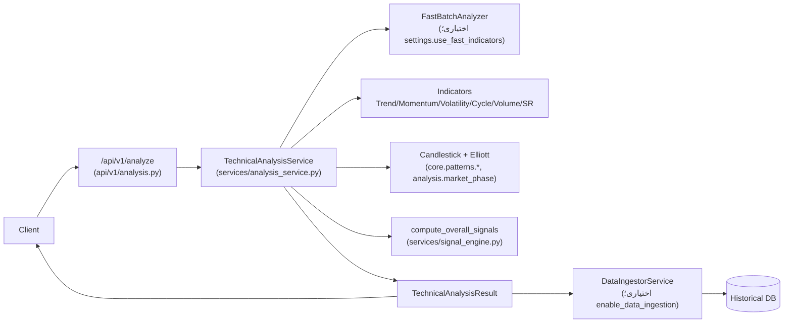
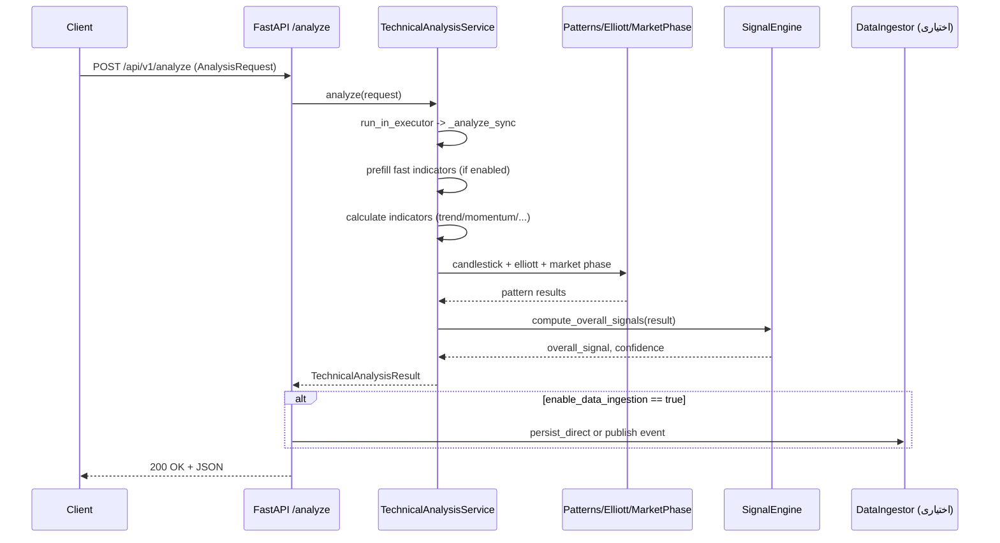

# فرایند تحلیل تکنیکال کامل (`POST /api/v1/analyze`)

این سند جریان کامل endpoint تحلیل تکنیکال را توضیح می‌دهد و به کدهای مرتبط اشاره می‌کند. ورودی‌ها حداقل ۵۰ کندل هستند (برای پوشش کامل اندیکاتورها ۶۰+ توصیه می‌شود).

## جریان کلی

## سکانس درخواست

## مراحل و وابستگی‌ها
1. **ورودی** (`AnalysisRequest` در `core/contracts/analysis.py`):  
   - `symbol`, `timeframe` (regex محدود)، `candles` (حداقل ۶۰ توصیه‌شده؛ در endpoint ۶۰ الزامی است).  
   - `candles` باید ترتیب زمانی و high>=low داشته باشند (اعتبارسنجی در مدل Candle).
2. **Prefill سریع** (`_prefill_fast_indicators`): اگر `settings.use_fast_indicators` فعال باشد، مسیر FastBatchAnalyzer برخی اندیکاتورها را محاسبه و در نتیجه قرار می‌دهد تا دوباره محاسبه نشوند.
3. **محاسبه اندیکاتورها**:  
   - Trend: SMA/EMA/WMA/DEMA/TEMA/MACD/ADX و ... (به داده کافی نیاز دارد؛ برخی 60 کندل).  
   - Momentum، Volatility، Volume، Cycle، Support/Resistance با نقشه‌های مربوطه.  
4. **الگوها و تحلیل‌های مکمل**:  
   - Candlestick (`patterns/candlestick.py`)  
   - Elliott Wave (`patterns/elliott_wave.py`)  
   - فاز بازار داو (`analysis/market_phase.py`)  
5. **تجمیع سیگنال** (`services/signal_engine.py`): محاسبه سیگنال کلی، confidence و سیگنال‌های دسته‌ای.
6. **ذخیره/انتشار نتیجه (اختیاری)** (`_maybe_publish_analysis_event` در `api/v1/analysis.py`):  
   - اگر `enable_data_ingestion` فعال باشد و بروکر نباشد → ذخیره مستقیم از طریق `data_ingestor_service.persist_direct`.  
   - اگر Kafka/RabbitMQ فعال باشد → انتشار رویداد `ANALYSIS_COMPLETED`.

## تنظیمات موثر (`config/settings.py`)
- `use_fast_indicators` (پیش‌فرض true): فعال‌سازی مسیر سریع اندیکاتورها.
- `enable_data_ingestion` (پیش‌فرض true): ذخیره/انتشار نتایج تحلیل.
- `cache_enabled` و تنظیمات Redis در `cache_service` برای readiness و کش (تحلیل بدون Redis هم کار می‌کند).
- `enable_scenarios`/`expose_db_explorer` تأثیری بر این endpoint ندارند.

## خطاها و وضعیت‌ها
- داده ناکافی یا candle نامعتبر: 400 (حداقل ۶۰ کندل).  
- خطای داخلی در محاسبات: 500 با پیام «Analysis failed: ...».  
- نبود داده در حالت historical (`/analyze/historical/{symbol}`): 404.

## نقاط بهبود/ریسک
- حداقل کندل اکنون ۶۰ است؛ برای اندیکاتورهای طولانی‌تر از ۶۰ کافی است.  
- `list_indicators` با لیست پیاده‌سازی‌شده هم‌تراز شده است؛ در صورت افزودن اندیکاتور جدید باید به‌روزرسانی شود.  
- وابستگی به `src.database.tse_data_source` در `/analyze/historical` همچنان وجود دارد و خارج از ساختار بسته‌بندی استاندارد ممکن است نیاز به تنظیم PYTHONPATH داشته باشد.  
- مسیر ingestion در صورت استثناء فقط هشدار log می‌دهد؛ ضمانت ذخیره‌سازی ندارد (best-effort).

## فایل‌های مرتبط
- `src/gravity_tech/api/v1/analysis.py`
- `src/gravity_tech/services/analysis_service.py`
- `src/gravity_tech/services/signal_engine.py`
- `src/gravity_tech/patterns/candlestick.py`, `src/gravity_tech/patterns/elliott_wave.py`
- `src/gravity_tech/analysis/market_phase.py`
