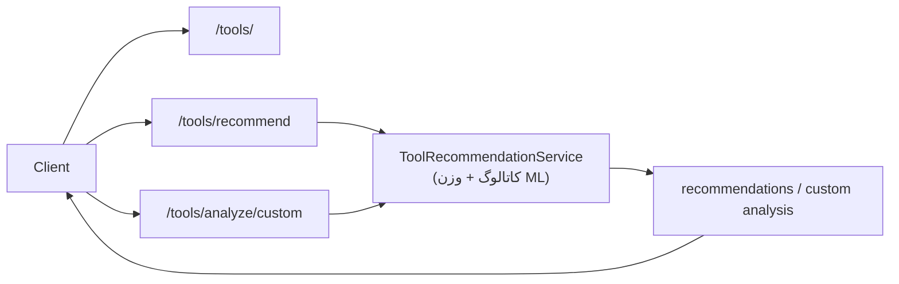
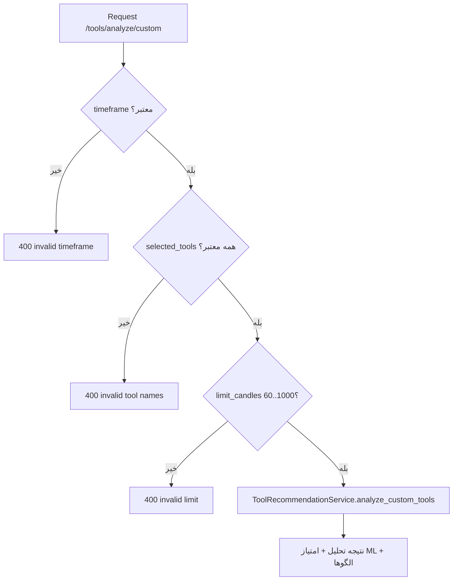

# فرآیند توصیه ابزار و تحلیل سفارشی (`/api/v1/tools/*`)

## جریان کلی

## ورودی/خروجی
- `/tools/`: فهرست ابزارها با فیلتر `category|timeframe|min_accuracy` و `limit` (۱..۲۰۰).
- `/recommend`: ورودی `symbol|timeframe|analysis_goal|trading_style|limit_candles|top_n`. خروجی: گروه‌بندی must_use/recommended/optional/avoid + استراتژی پویا + متادیتای ML.
- `/analyze/custom`: ورودی `selected_tools` (۱..۳۰ نام معتبر)، `include_ml_scoring`، `include_patterns`، `limit_candles` (۶۰..۱۰۰۰)، `timeframe` معتبر. خروجی: نتایج هر ابزار + امتیاز ML + الگوهای کشف‌شده + خلاصه.

## کنترل‌ها و تضمین‌ها
- `timeframe` در هر دو درخواست روی لیست مجاز `1m..1w` اعتبارسنجی می‌شود.
- نام ابزارهای ورودی در `/analyze/custom` با کاتالوگ چک می‌شود؛ ابزار نامعتبر => HTTP 400.
- `limit_candles` علاوه بر Pydantic، در سطح سرویس ۶۰..۱۰۰۰ سخت‌گیرانه می‌شود؛ عدد نامعتبر => HTTP 400.
- خطاهای کاربری به ۴۰۰ و خطاهای داخلی به ۵۰۰ تفکیک شده‌اند.

## دیاگرام اعتبارسنجی تحلیل سفارشی

## محدودیت‌ها
- صفحه‌بندی فهرست ابزارها فقط با `limit` انجام می‌شود (offset/pagination کامل وجود ندارد).
- Rate limiting / timeout لایه بالادستی نیاز است؛ درون سرویس کنترل فشار سنگین انجام نمی‌شود.
- دقت/وزن‌دهی ML وابسته به کیفیت مدل و داده ورودی است؛ نیازمند مانیتورینگ.
