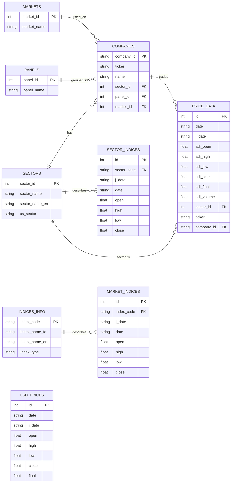
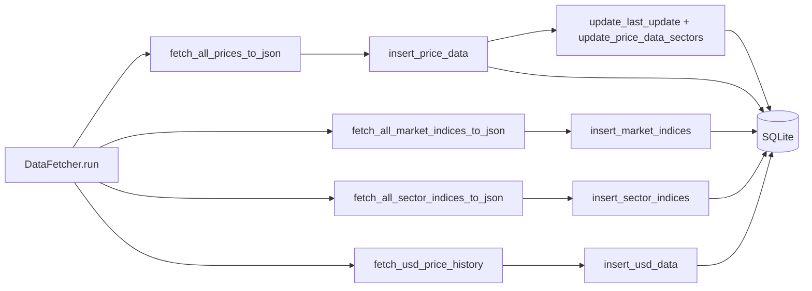

# مستند پایگاه داده (GravityTseHisPrice)

پایگاه داده SQLite برای نگه‌داری تاریخچه قیمت، شاخص‌های بازار/صنعت و متادیتای به‌روزرسانی استفاده می‌شود. مسیر فایل پایگاه داده `data/tse_data.db` در `src/config.py` (کلید `DB_FILE`) تعریف شده است. ساخت همه جداول توسط `init_price_data.create_tables()` و `init_price_data.create_indices_tables()` انجام می‌شود و `PRAGMA foreign_keys = ON` فعال است.

## مسیرها و ورودی‌ها
- پایگاه داده: `data/tse_data.db`
- پیکربندی: `src/config.py`
- داده‌های مرجع اولیه: `data/BasicTseInformation/{companies,sectors,markets,panels}.json`
- متادیتا: `last_updates` (در DB) برای آخرین تاریخ همگام‌سازی به‌صورت میلادی ISO. مقدارهای sentinel در کد: `INITIAL_START_DATE_GREGORIAN = '2011-03-21'` و `INITIAL_START_DATE_JALALI = '1390-01-01'`؛ وقتی مقدار یافت نشود، `DataFetcher` از مقدار جلالی شروع می‌کند.

## جداول و ستون‌ها
### مرجع پایه
- `sectors(sector_id PK, sector_name, sector_name_en, us_sector)`
- `markets(market_id PK, market_name)`
- `panels(panel_id PK, panel_name)`
- `indices_info(index_code PK, index_name_fa, index_name_en, index_type in {market, sector})` – با `insert_indices_info` پر می‌شود.
- `companies(company_id PK, ticker UNIQUE, name, sector_id FK→sectors, panel_id FK→panels, market_id FK→markets)`؛ در صورت نبود سکتور، `insert_companies` آن را اضافه می‌کند و برای پنل/بازار مقدار خالی می‌گذارد.

### داده‌های حجیم
- `price_data(id PK AUTOINCREMENT, date, j_date, adj_open, adj_high, adj_low, adj_close, adj_final, adj_volume, sector_id FK→sectors, ticker, company_id FK→companies, UNIQUE(ticker,date))`
- `market_indices(id PK AUTOINCREMENT, index_code FK→indices_info, j_date, date, open, high, low, close, UNIQUE(index_code,date))`
- `sector_indices(id PK AUTOINCREMENT, sector_code FK→sectors, j_date, date, open, high, low, close, UNIQUE(sector_code,date))`
- `usd_prices(id PK AUTOINCREMENT, date, j_date, open, high, low, close, final, UNIQUE(date))`

### متادیتا
- `last_updates(symbol PK, last_date)` – تاریخ‌ها میلادی هستند و برای واکشی افزایشی استفاده می‌شوند.

## جریان درج و به‌روزرسانی
- `create_tables` و `create_indices_tables` جداول پایه، شاخص‌ها و جدول USD را می‌سازند.
- `load_initial` در CLI داده‌های مرجع (`sectors/markets/panels/companies`) را از JSON وارد می‌کند. `insert_companies` در صورت نبود سکتور جدید، آن را اضافه می‌کند.
- `DataFetcher.run` (در `src/fetcher.py`) مراحل زیر را انجام می‌دهد:
  1. `fetch_all_prices_to_json`: برای هر شرکت از `last_updates` شروع می‌کند، داده تعدیل‌شده را از `gravity_tse` می‌گیرد، در `price_data` درج می‌کند و `last_updates[ticker]` را به‌روز می‌کند.
  2. `fetch_usd_price_history`: USD را واکشی و در `usd_prices` ذخیره می‌کند و `last_updates['USD']` را می‌نویسد.
  3. `fetch_all_market_indices_to_json`: شاخص‌های بازار (CWI/EWI/...) را می‌گیرد، در `market_indices` درج و `last_updates[index_code]` را به‌روز می‌کند.
  4. `fetch_all_sector_indices_to_json`: شاخص‌های صنعت را با نگاشت `SECTOR_NAME_MAPPING` واکشی و در `sector_indices` درج می‌کند و `last_updates['SECTOR_<code>']` را به‌روز می‌کند.
  5. `update_price_data_sectors`: پس از درج، `sector_id` را از جدول `companies` برای رکوردهای `price_data` پر می‌کند.
- API (`web/api.py`) و داشبورد (`web/dashboard.py`) از طریق `pandas.read_sql` روی همین پایگاه داده خواندن انجام می‌دهند.

## توصیه‌های کارایی
- ایندکس‌ها در `create_tables` و `create_indices_tables` ساخته می‌شوند؛ در صورت نیاز کوئری بالا را تکرار کنید:
```sql
CREATE INDEX IF NOT EXISTS idx_price_ticker_date ON price_data(ticker, date);
CREATE INDEX IF NOT EXISTS idx_price_date ON price_data(date);
CREATE INDEX IF NOT EXISTS idx_market_index_date ON market_indices(index_code, date);
CREATE INDEX IF NOT EXISTS idx_sector_code_date ON sector_indices(sector_code, date);
```
- برای حجم‌های بالا، `PRAGMA journal_mode=WAL` و اجرای دوره‌ای `VACUUM` پیشنهاد می‌شود.

## کوئری‌های پایش سریع
```sql
SELECT name FROM sqlite_master WHERE type='table' AND name NOT LIKE 'sqlite_%';
SELECT ticker, MAX(date) AS last_date FROM price_data GROUP BY ticker ORDER BY last_date DESC LIMIT 5;
SELECT * FROM last_updates ORDER BY last_date DESC LIMIT 5;
SELECT index_code, COUNT(*) AS cnt FROM market_indices GROUP BY index_code;
```

## دیاگرام ER


## جریان ETL

