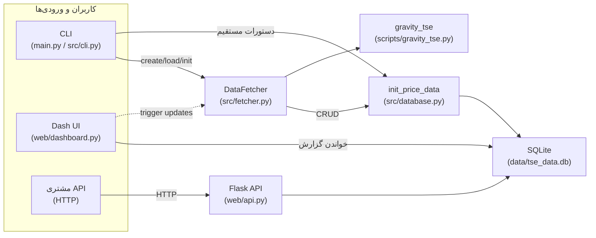
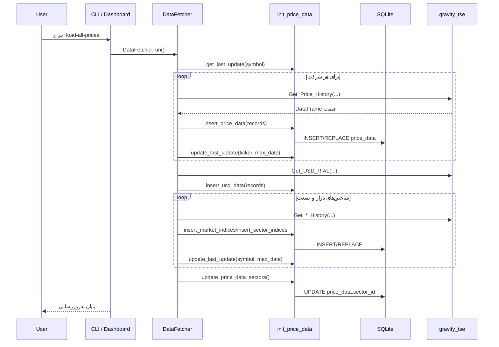
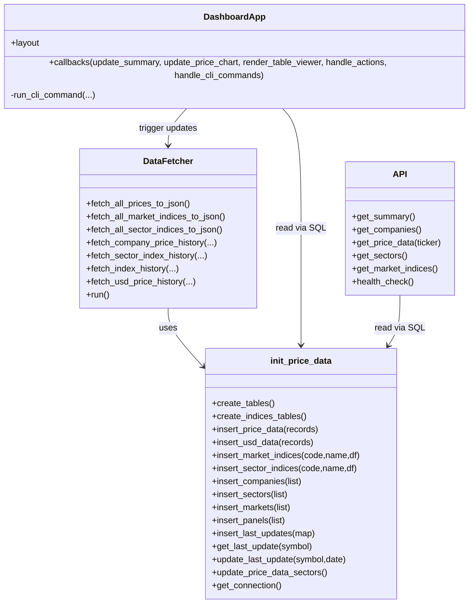

# UML و معماری (GravityTseHisPrice)

دیاگرام‌ها با Mermaid نگارش شده‌اند و اجزای اصلی، توالی به‌روزرسانی و کلاس‌های کلیدی کد فعلی را نمایش می‌دهند.

## معماری سطح بالا

## Sequence: به‌روزرسانی کامل داده‌ها (`load-all-prices`/`init-all`)

## کلاس‌ها و نقش‌ها

