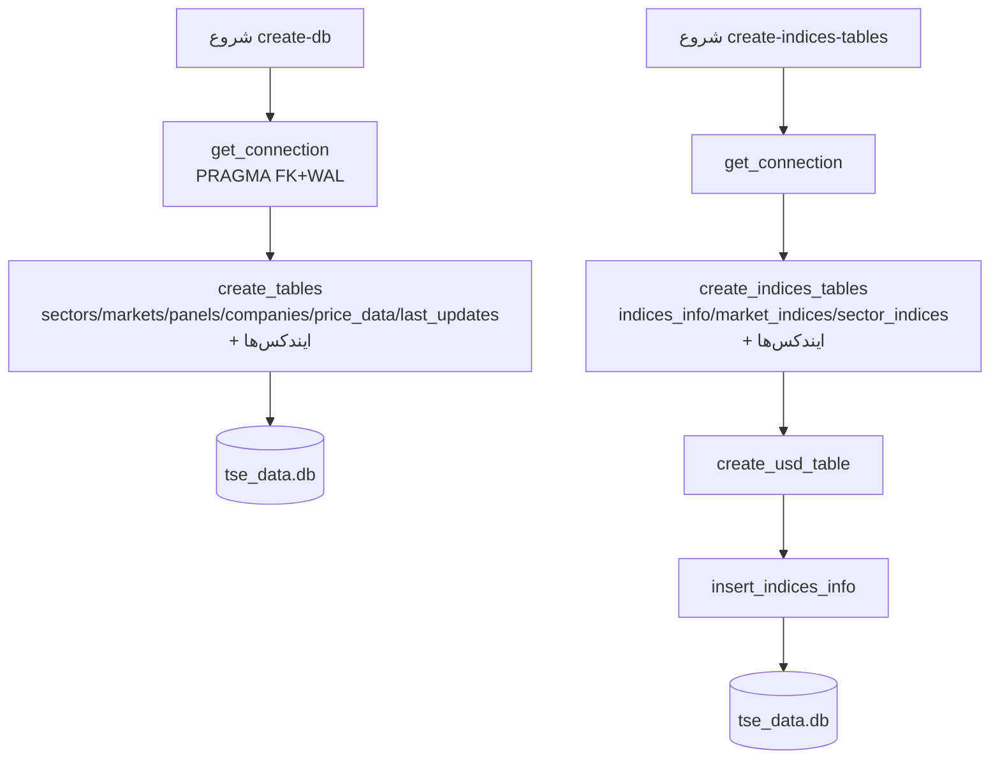

# فرآیند ۱: ایجاد پایگاه داده و جداول پایه/شاخص

این فرآیند ساخت پایگاه داده SQLite و جداول اصلی/شاخص را بر عهده دارد.

## هدف
- ایجاد جداول مرجع (`sectors`, `markets`, `panels`, `companies`)
- ایجاد جداول داده حجیم (`price_data`, `last_updates`)
- ایجاد جداول شاخص و USD (`indices_info`, `market_indices`, `sector_indices`, `usd_prices`)
- فعال‌سازی قیود و ایندکس‌ها برای کارایی (`foreign_keys`, `WAL`, ایندکس‌ها)

## پیش‌نیازها
- Python و پکیج‌های پروژه (`pip install -r requirements.txt`)
- مسیر پایگاه داده: `data/tse_data.db` (در `src/config.py: DB_FILE`)

## دستور اجرا
```bash
python main.py create-db
python main.py create-indices-tables
```

## گام‌ها (در کد)
1) `init_price_data.get_connection`: اتصال SQLite با `PRAGMA foreign_keys=ON`, `journal_mode=WAL`, `synchronous=NORMAL`
2) `create_tables`:
   - ساخت جداول `sectors`, `markets`, `panels`, `companies`, `price_data`, `last_updates`
   - ایجاد ایندکس‌ها: `idx_price_ticker_date`, `idx_price_date`
3) `create_indices_tables`:
   - ساخت جداول `indices_info`, `market_indices`, `sector_indices`
   - ایجاد ایندکس‌ها: `idx_market_index_date`, `idx_sector_code_date`
   - ساخت جدول USD (`create_usd_table`)
   - درج داده مرجع شاخص‌ها (`insert_indices_info`)

## ورودی/خروجی
- ورودی: هیچ (تنها فایل DB روی دیسک)
- خروجی: فایل `data/tse_data.db` با جداول خالی و ایندکس‌های ساخته‌شده

## خطاهای رایج
- مجوز نوشتن روی `data/` را ندارید → با کاربر دارای دسترسی اجرا کنید.
- فایل DB قفل است (مثلاً در Dash/DB Browser) → فرایندهای دیگر را ببندید و دوباره اجرا کنید.

## دیاگرام جریان

