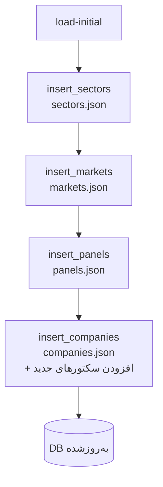

# فرآیند ۲: بارگذاری داده‌های مرجع اولیه

این فرآیند داده‌های پایه (سکتور/بازار/تابلو/شرکت) را از فایل‌های JSON به جداول مرجع وارد می‌کند.

## هدف
- پر کردن جداول مرجع قبل از درج قیمت‌ها
- افزودن سکتورهای جدیدی که در JSON شرکت‌ها وجود دارند اما در لیست اصلی نیستند

## پیش‌نیازها
- اجرای موفق فرآیند ۱ (جداول ساخته شده)
- فایل‌های JSON: `data/BasicTseInformation/{sectors,markets,panels,companies}.json`

## دستور اجرا
```bash
python main.py load-initial
```

## گام‌ها (در کد)
1) خواندن `sectors.json` → `insert_sectors`
2) خواندن `markets.json` → `insert_markets`
3) خواندن `panels.json` → `insert_panels`
4) خواندن `companies.json` → `insert_companies`
   - در صورت نبود سکتور، آن را می‌سازد
   - در صورت نبود پنل/بازار، مقدار NULL درج می‌شود

## ورودی/خروجی
- ورودی: JSONهای مرجع
- خروجی: جداول `sectors`, `markets`, `panels`, `companies` پر می‌شوند

## خطاهای رایج
- نبود یا خرابی فایل JSON → مسیر/فرمت را اصلاح کنید.
- داده تکراری: به‌دلیل `INSERT OR REPLACE`، رکوردهای تکراری جایگزین می‌شوند.

## دیاگرام جریان

