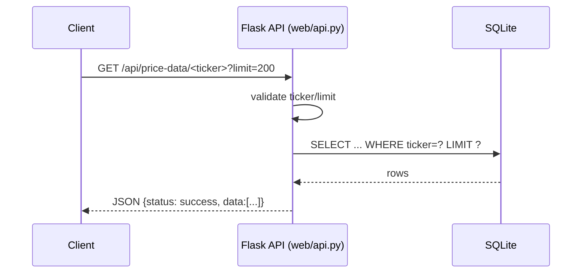

# فرآیند ۴: سرویس API (Flask)

این فرآیند راه‌اندازی و ارائه Endpointهای REST برای خواندن داده‌ها را پوشش می‌دهد.

## هدف
- ارائه دسترسی HTTP به خلاصه بازار، شرکت‌ها، قیمت‌ها، سکتورها و شاخص‌های بازار
- ایمن‌سازی ورودی‌ها (بایند پارامتر، محدودسازی limit و ticker)

## پیش‌نیازها
- پایگاه داده موجود (`data/tse_data.db`)
- نصب وابستگی‌ها: `Flask`, `flask-cors`, `pandas`

## دستور اجرا
```bash
python web/api.py
# پیش‌فرض: http://127.0.0.1:5000/
```

## Endpointها
- `GET /api/summary` خلاصه تعداد شرکت/رکورد/تاریخ آخرین به‌روزرسانی/تعداد سکتور
- `GET /api/companies?sector_id=&limit=` فهرست شرکت‌ها (فیلتر اختیاری سکتور)
- `GET /api/price-data/<ticker>?limit=` تاریخچه قیمت (OHLC/Final/Volume)
- `GET /api/sectors` فهرست سکتورها + تعداد شرکت
- `GET /api/market-indices?limit=` داده شاخص‌های بازار با متادیتا
- `GET /health` بررسی سلامتی

## نکات امنیت/پایداری
- پارامترها بایند شده‌اند (`_safe_limit`, `_safe_ticker`, `_safe_sector_id`)
- پیام خطا به شکل عمومی برمی‌گردد؛ جزئیات در لاگ (`logger.exception`)

## دیاگرام توالی


## خطاهای رایج
- `invalid ticker` → ورودی خارج از الگوی مجاز
- `internal error` → لاگ سرور را بررسی کنید (اتصال DB، کوئری، یا فایل DB موجود نیست)
